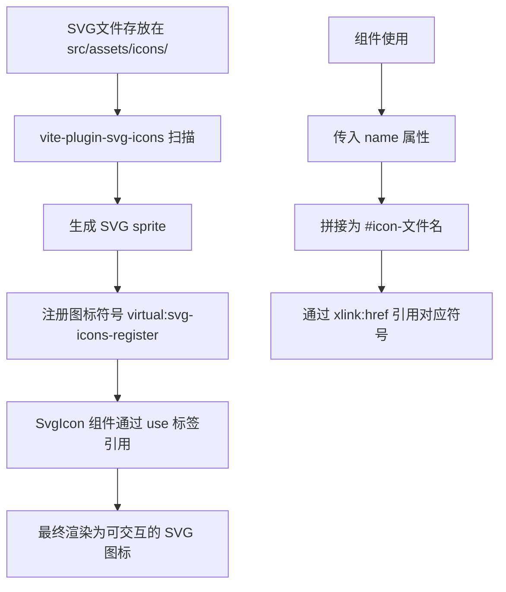

# SvgIcon 组件工作原理分析

## **官方文档链接**请先阅读

https://www.viterc.cn/en/vite-plugin-svg-icons.html

## 1. 组件基本结构

[`SvgIcon`](src/components/SvgIcon/index.vue) 组件是一个基于 SVG sprite 技术的图标组件，主要包含：

**Props 定义：**

- `prefix`: 图标前缀，默认为 `#icon-`
- `name`: 图标名称（必需）
- `color`: 图标颜色，默认为空
- `width`: 图标宽度，默认 `16px`
- `height`: 图标高度，默认 `16px`

**模板结构：**

```vue
<svg :style="{ width, height }">
  <use :xlink:href="prefix + name" :fill="color"></use>
</svg>
```

## 2. SVG Sprite 系统工作机制

这个项目使用了 **SVG sprite** 技术，工作流程如下：

1. **图标收集**: [`vite-plugin-svg-icons`](vite.config.ts:29-34) 插件扫描 [`src/assets/icons/`](src/assets/icons/) 目录
2. **Sprite 生成**: 插件将所有 SVG 文件合并成一个 sprite，每个图标分配唯一 ID
3. **符号注册**: 通过 [`import 'virtual:svg-icons-register'`](src/main.ts:4) 注册所有图标符号
4. **引用使用**: 组件通过 `<use>` 标签引用对应的图标符号

## 3. Vite 插件配置

在 [`vite.config.ts`](vite.config.ts:29-34) 中的关键配置：

```typescript
createSvgIconsPlugin({
  // 指定图标文件夹
  iconDirs: [path.resolve(process.cwd(), "src/assets/icons")],
  // 符号ID格式：icon-[目录名]-[文件名]
  symbolId: "icon-[dir]-[name]",
});
```

## 4. 图标文件组织

图标文件存放在 [`src/assets/icons/`](src/assets/icons/) 目录下，包含：

- `github_icon.svg` - GitHub 图标
- `search.svg` - 搜索图标
- `like.svg` / `like-selected.svg` - 点赞图标
- `collection.svg` / `collection-selected.svg` - 收藏图标
- 等 47+ 个 SVG 图标文件

## 5. 使用方式和实际案例

**基本使用：**

```vue
<SvgIcon name="github_icon" width="100px" height="100px" />
```

**带颜色：**

```vue
<SvgIcon name="recommend" color="#409EFF" class="icon" />
```

**实际项目中的使用案例：**

- [`src/views/About/index.vue:42`](src/views/About/index.vue:42): GitHub 图标展示
- [`src/views/Home/Main/index.vue:6`](src/views/Home/Main/index.vue:6): 公告通知图标
- [`src/views/Article/index.vue:322-323`](src/views/Article/index.vue:322-323): 点赞状态切换图标

## 6. 完整工作流程



## 核心优势

1. **性能优化**: 所有图标合并为一个 sprite，减少 HTTP 请求
2. **灵活控制**: 可通过 CSS 或 props 控制颜色、大小
3. **类型安全**: TypeScript 支持，开发时有智能提示
4. **按需加载**: 只有使用的图标才会被包含在最终构建中

你的猜想是正确的！这个组件确实会去引入 [`@/src/assets/icons/`](src/assets/icons/) 下的 SVG 文件，通过 Vite 插件将它们转换为可复用的 SVG sprite 系统。

## **SvgIcon代码**

```html
<template>
  <!-- svg：图标外层容器节点，内部需要与 use 标签结合使用 -->
  <svg :style="{ width, height }">
    <!-- xlink:href执行用哪一个图标，属性值务必#icon-图标名字 -->
    <!-- use 标签 fill 属性可以设置图标的颜色 -->
    <use :xlink:href="prefix + name" :fill="color"></use>
  </svg>
</template>

<script setup lang="ts">
  // 接收父组件传递过来的参数
  defineProps({
    // xlink:href 属性值的前缀
    prefix: {
      type: String,
      default: "#icon-",
    },
    // 提供使用的图标的名字
    name: String,
    // 接收父组件传递的颜色
    color: {
      type: String,
      default: "",
    },
    // 接收父组件传递过来的图标宽度
    width: {
      type: String,
      default: "16px",
    },
    // 接收父组件传递过来的图标高度
    height: {
      type: String,
      default: "16px",
    },
  });
</script>

<style scoped lang="scss"></style>
```
