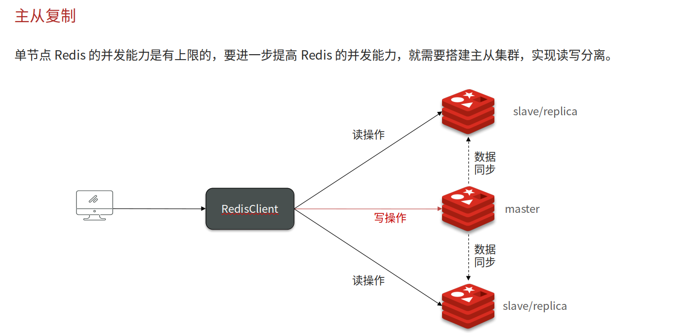
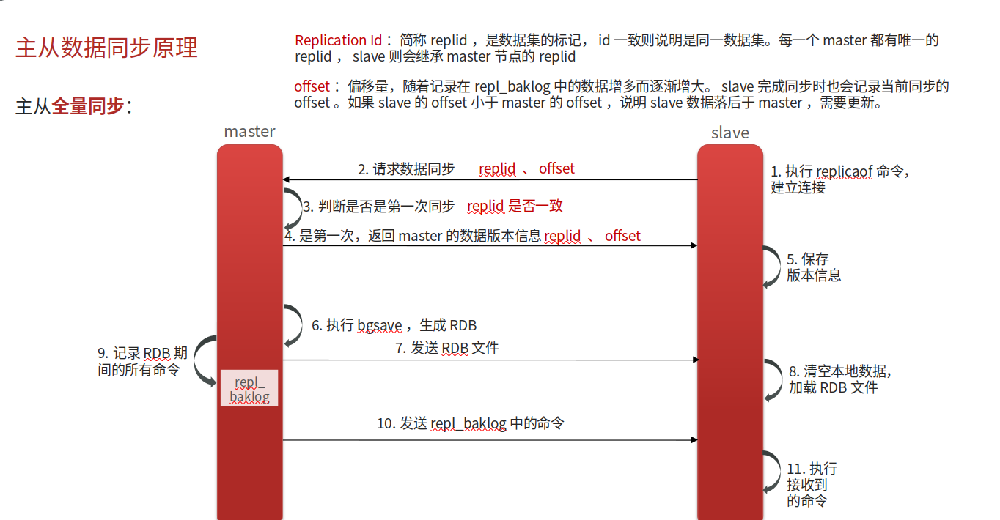
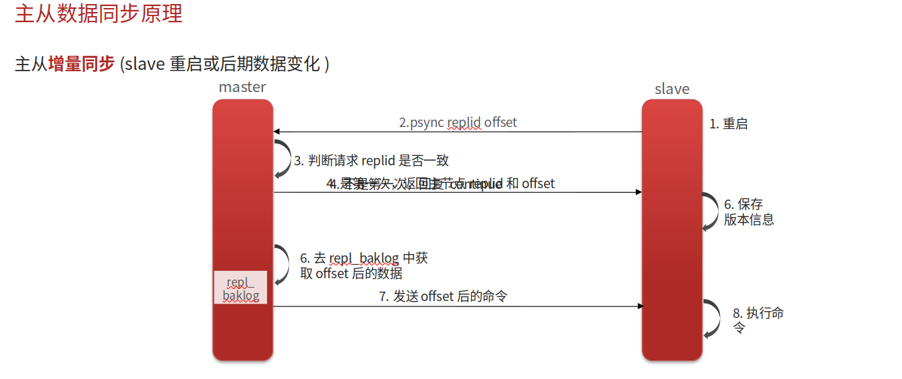

# Redis主从复制，主从同步

## 自己理解

单节点的读写是有上限的，所以就会布置集群模式来提高上限，一般都是一主(master)多从(slave)，又因为Redis多是读多写少，所以主节点负责写数据，而从节点负责读数据这样就提高了并发上限。想要保证主从同步，一般有全量同步以及增量同步方式，

全量同步：

1. 从节点向主节点请求数据同步，同时发送自己的repliaction id 和offset（偏移量）
2. 主节点检查是否是第一次同步（repliaction id 和 offset），是得话，发送自己的repliaction id 和 offset 保证主从版本一致性
3. 主节点执行bgsave生成RDB文件，将其发送给从节点，从节点删除本地数据，依靠主节点的RDB恢复数据
4. 主节点在生成RDB文件期间，也会有数据请求，所以会以命令的方式生成一个log文件【主节点生成 RDB 时，会把写命令先存到一个**复制缓冲区（repl_backlog_buffer）** 里】
5. 将log文件发送给从节点进行补缺

增量同步：

1. 从节点向主节点请求数据同步，主节点判断是否是第一次，不是则获取从节点的offset值
2. 主节点根据offset值将从节点的差量发送给从节点，从节点根据差量补缺同步数据

## 网上笔记

