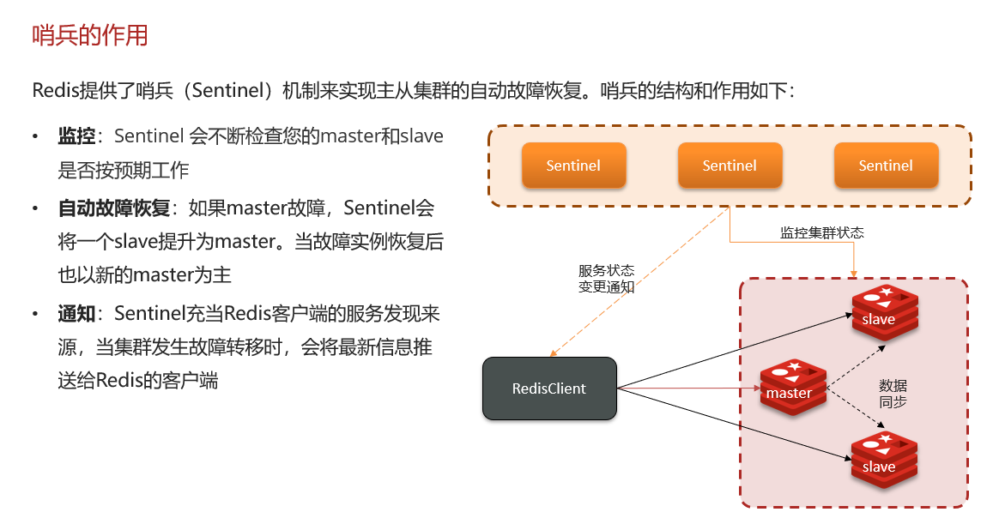
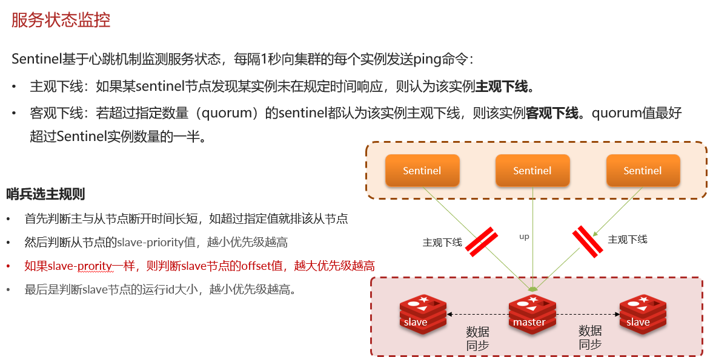
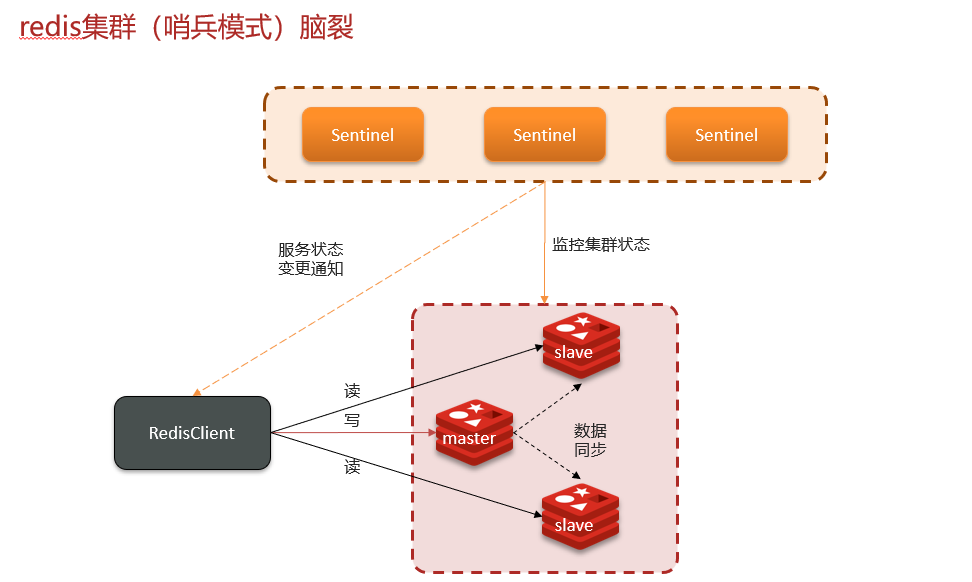
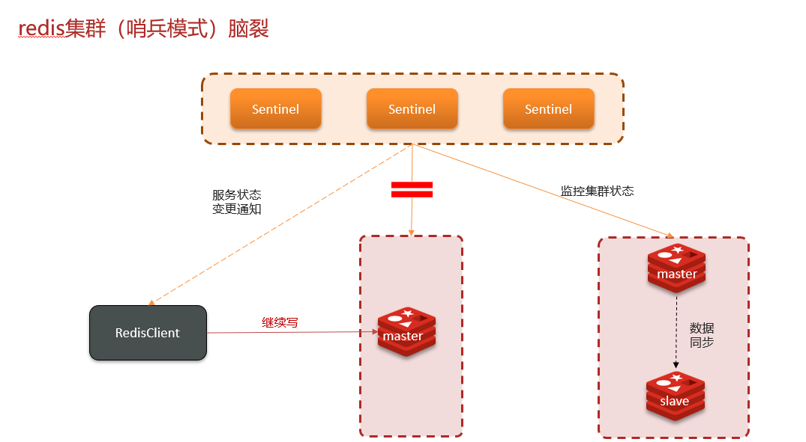
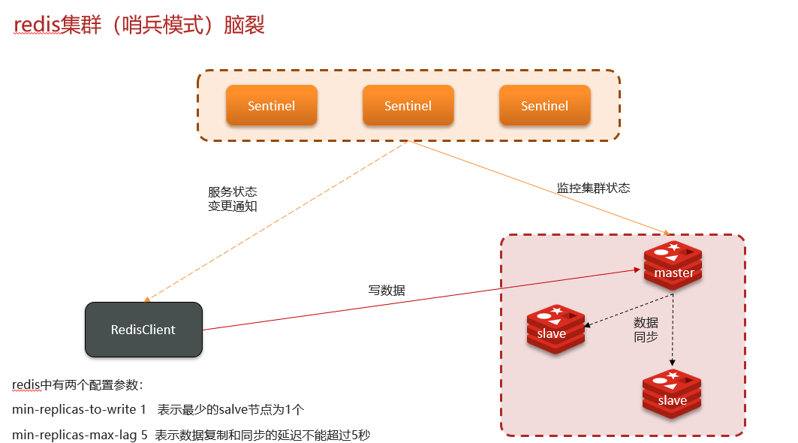

# Redis哨兵模式，集群脑裂

## 自己理解

### **问题 1：怎么保证 Redis 的高并发高可用？**

**我的理解**：
要让 Redis 又能扛住高并发、还不容易挂，得这么搞～ 首先高并发靠**主从集群**，主节点专门处理写操作，比如用户下单扣库存这种，从节点负责读，像商品详情页缓存、热门数据查询，把读请求分散到多个从节点，这样读压力就被分摊了。然后高可用得靠**哨兵模式**，哨兵就像个自动管家，一直盯着主节点，要是主节点突然挂了，哨兵能立刻从从节点里选一个新主，还能通知客户端换连接，不用人工干预，这样服务就不会中断啦。主从分担读写压力，哨兵兜底故障，两者配合就能实现高并发 + 高可用～

### **问题 2：你们使用 redis 是单点还是集群，哪种集群？**

**我的理解**：
我们项目用的是**主从集群（1 主 1 从）加上哨兵模式**～ 选这个主要是因为业务里读多写少，主从的读写分离刚好能扛住读请求的压力，而且哨兵能自动处理主节点故障，不用半夜起来改配置紧急修复。另外我们把单节点内存控制在 10G 以内，因为 Redis 内存太大的话，生成 RDB 或者主从同步时容易卡。要是以后不同业务（比如用户缓存、订单缓存）数据量起来了，就给每个业务单独配一套主从 + 哨兵，避免互相影响。这样既解决了单点故障问题，又能灵活扩展，成本和复杂度也在可接受范围内～

### **问题 3：redis 集群脑裂，该怎么解决呢？**

**我的理解**：
脑裂就是网络出问题时，哨兵误会主节点挂了，提拔了新主，结果老主其实还活着，导致两个主节点同时干活，客户端可能往老主写数据，新主没同步到，数据就乱套了。解决的话，一方面得让哨兵别乱判，比如调整`sentinel down-after-milliseconds`，别因为网络抖动就误判主节点挂了；另一方面得限制脑裂的影响，配置`sentinel min-slaves-to-write`和`sentinel min-slaves-max-lag`，要求主节点至少有 1 个从节点，而且从节点同步延迟不能太高（比如 10 秒），要是达不到条件，主节点就拒绝写请求。这样即使脑裂发生，老主也写不了数据，新主才会被认可，就能减少数据丢失啦～

## 网上笔记

**脑裂成下图**

