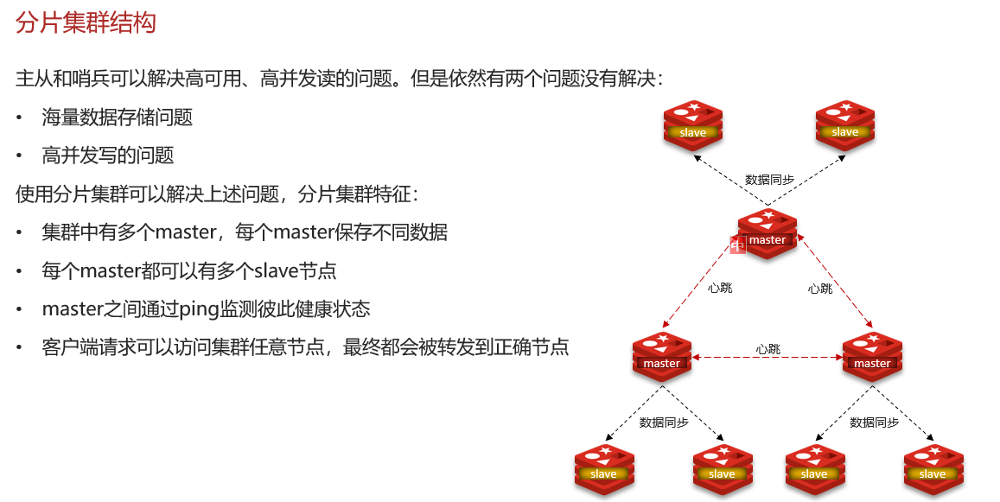
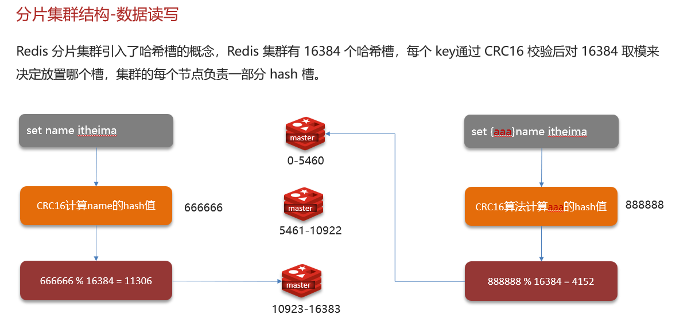

# Redis分片集群，数据读写规则

## 自己理解

### **问题 1：redis 的分片集群有什么作用？**

**你的理解（润色版）**：
Redis 分片集群主要解决 **“单节点存不下海量数据” 和 “单节点扛不住超高并发”** 的问题～ 集群里有多个 master 节点，每个 master 存不同的数据分片（比如用户 A 的数据存在 master1，用户 B 的存在 master2）。而且每个 master 还能挂多个 slave，既可以分担读压力，又能当备份。节点之间用类似 “心跳” 的机制（其实是 Gossip 协议）互相监控健康状态，不像哨兵那样严格选举，更灵活。客户端访问时，不管连哪个节点，都会通过哈希槽找到真正存数据的节点，这样就能横向扩展，存更多数据、扛更高并发啦～

### **问题 2：Redis 分片集群中数据是怎么存储和读取的？**

**你的理解（润色 + 补充版）**：
分片集群用**哈希槽（16384 个）** 来分配数据！每个 master 节点会负责一部分槽（比如 master1 管 0-5000 槽，master2 管 5001-10000 槽）。当客户端存数据时，Redis 会对 key 做 CRC16 哈希计算，再对 16384 取模，算出该 key 属于哪个槽，然后找到负责这槽的 master 存数据。读数据时逻辑一样，先算 key 该去哪个槽，再找对应节点取。这样不管数据量多大，都能均匀分散到不同节点，而且扩容 / 缩容时，只需要迁移槽和对应数据，不用动整个集群，特别灵活～

## 网上笔记

