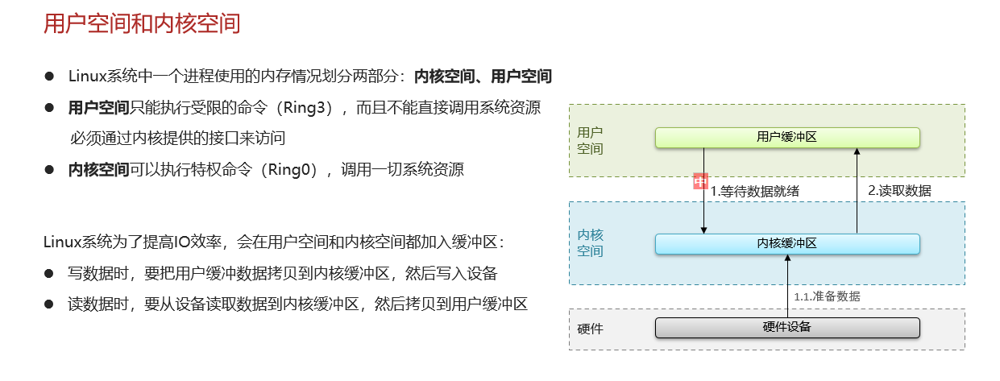
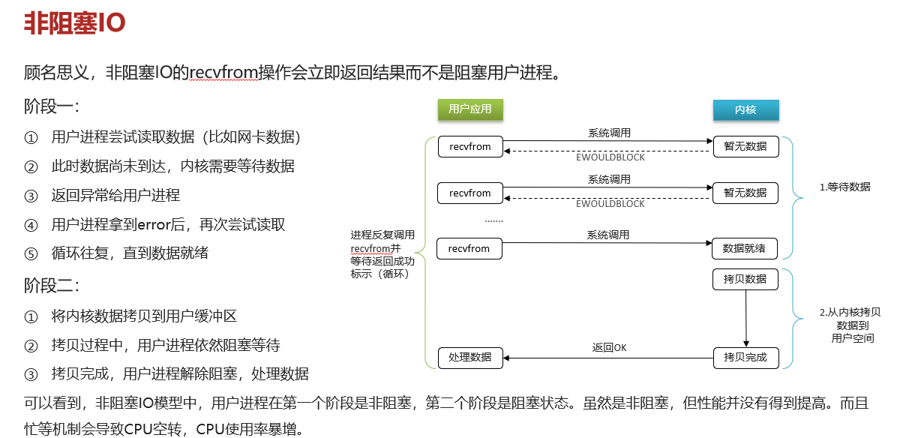
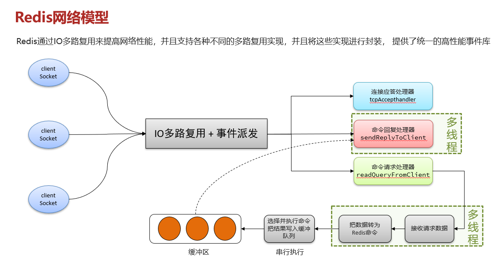

# Redis是单线程的，为什么还这么快？

## 自己理解？不是真的

### 面试官：Redis 是单线程的，但是为什么还那么快？

因为 Redis 基于内存存储，用 C 语言编写效率高；单线程避免线程切换、竞争锁的开销；借助 I/O 多路复用（像 epoll ），让一个线程能同时处理多个网络请求，不用卡着等 I/O ；而且持久化操作（如 bgsave ）丢给后台线程 / 进程，主线程继续跑，所以又快又稳 。

### 面试官：能解释一下 I/O 多路复用模型？

I/O 多路复用就像 “1 个门卫同时看多个快递柜”，不用守着一个柜等快递到（避免无效等待）。它让单线程通过 epoll 这类机制，同时监听好多客户端连接，哪个有数据读写需求（快递到了），就去处理，充分榨干 CPU ，Redis 用它处理网络请求，6.0 后还在回复环节加了点多线程辅助，但核心命令执行仍单线程，效率拉满 

## 网上笔记

