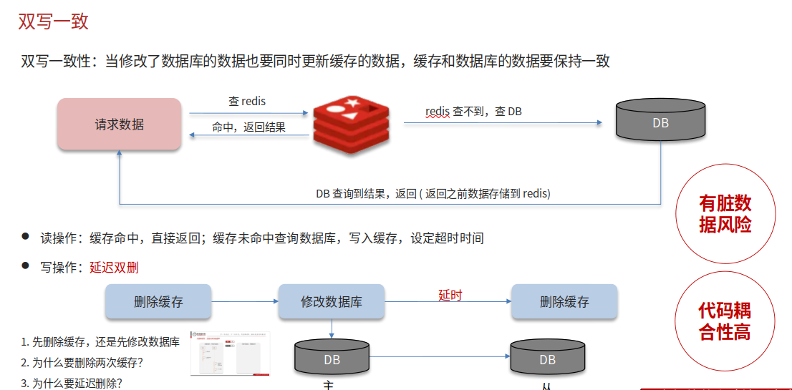
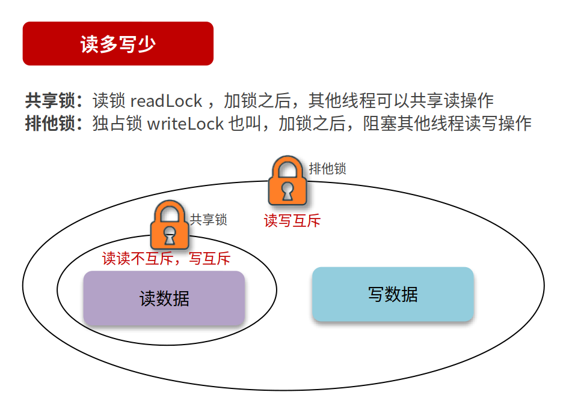
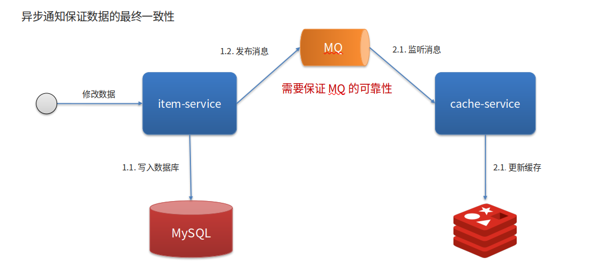
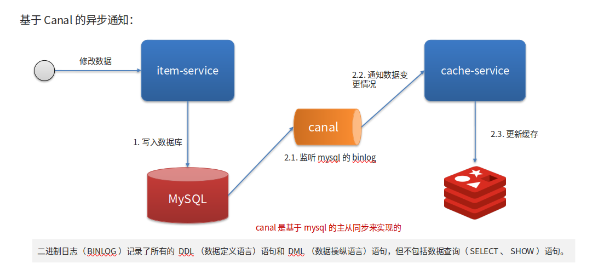

# Redis双写一致性

## 自己理解

保证Redis和像Mysql等数据库的数据保持数据同步，分两种情况读保持一致，写保持一致，而读保持一致如果发现Redis没命中，那么读取数据库时同时写入缓存，并且设定Key失效时间；而写保持一致又分延迟双删，即不管先写数据库后删除Redis缓存，还是先删除Redis缓存后在写入数据库，在一定延时后还要再次删除Redis缓存，目的当然是为了预防前面两步操作时可能出现脏数据的情况，这种情况怎么解决呢？那就像数据库学习时用的共享锁以及排他锁。然后写保持一致也可以用异步同步，即修改数据库时，会有个监听者去监听数据变化，然后写入Redis缓存，虽然会有一些延时，但这是最常用的方法

共享锁：在读取时上锁，但其他线程任然可以进行读取

排它锁：在写入时上锁，其他线程不能进行任何读写操作

## 网上笔记

第二种方法，可以短暂不一致（异步）

