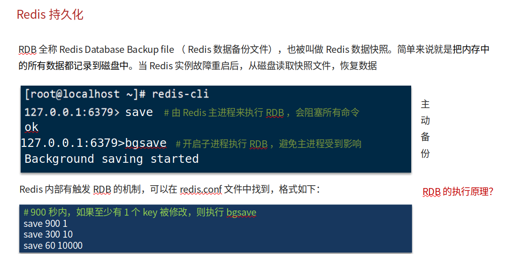
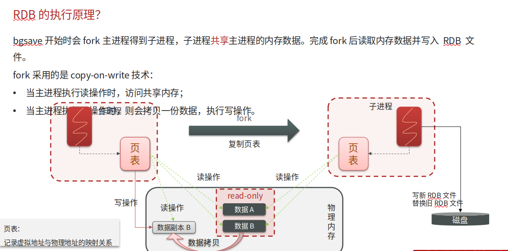
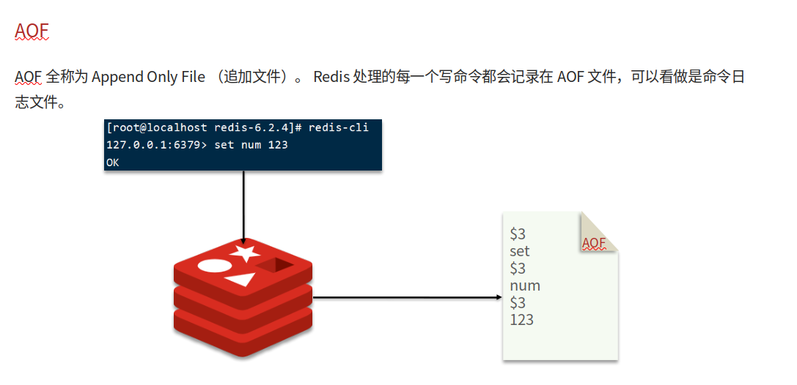
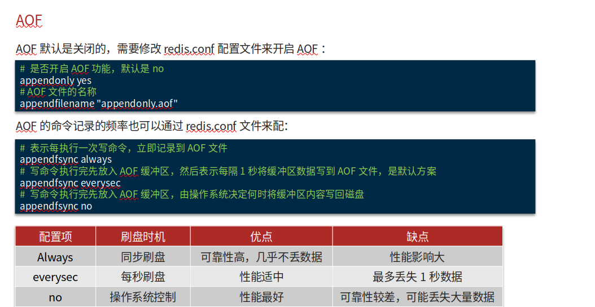
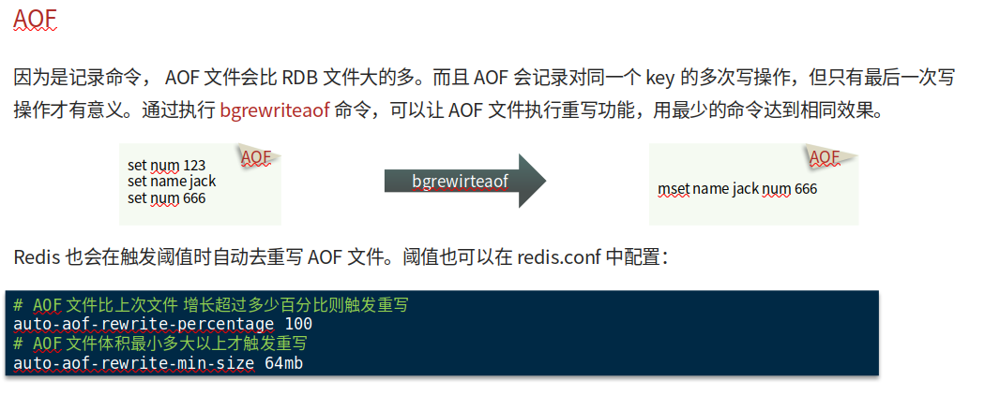

# Redis缓存持久化

## 自己理解

保证Redis宕机或重启时能够恢复到最后一次关闭前的状态，解决方法有RDB(Redis Data Backup file)，即Redis数据备份文件，通过每隔一段时间将Redis数据备份一份到硬盘上保证能够恢复，优点是2进制文件，缺点是因为是每隔一段时间备份，中间总会有一段时间出现问题了就没有备份，所以备份的数据不一定是最新的。另外一种解决方法是，AOF(Append only file) 是记录所有写操作日志（appendonly.aof），优点是数据更全（默认每秒刷盘，最多丢 1  秒数据），缺点是文件会变大，需要定期重写瘦身，恢复时要执行所有命令所以速度慢。实际用的时候常两者结合：RDB 做定期全量备份，AOF  保证日常数据安全，Redis 重启时优先用 AOF 恢复（数据更全），AOF 有问题再用 RDB 兜底～

## 网上笔记

