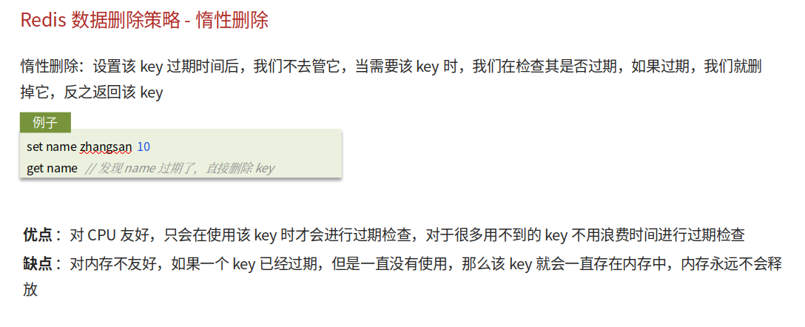
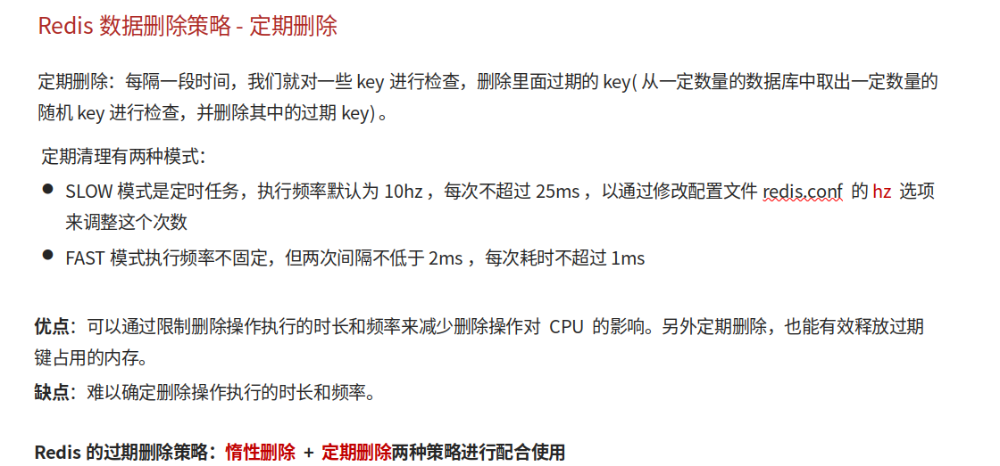

# Redis数据过期策略

## 自己理解

Redis一般都会设置Key值生效时间，但生效时间一过，该怎么处理？常用的是惰性删除和定期删除一起使用，惰性删除，即Key值失效，保留在内存，当下次读取时发现失效再删除，缺点就是会占用内存空间。如果大量的Key失效，也没有被读取，但当某一次大量请求来时可能就会诱发缓存雪崩。所以就会结合采用第二种策略定期删除，而定期删除分为Slow删，就是维持10Hz频率，每次清理不超过25ms具有周期性，限时性，随机抽查，另外一种就是Fast，频率不定，但两次删除间隔不超过2ms，每次清理不超过1ms

## 网上笔记

