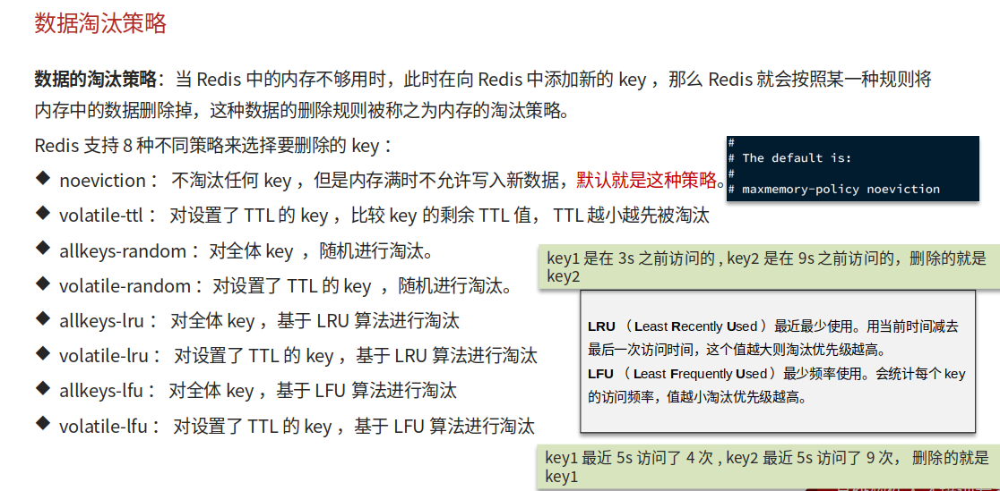
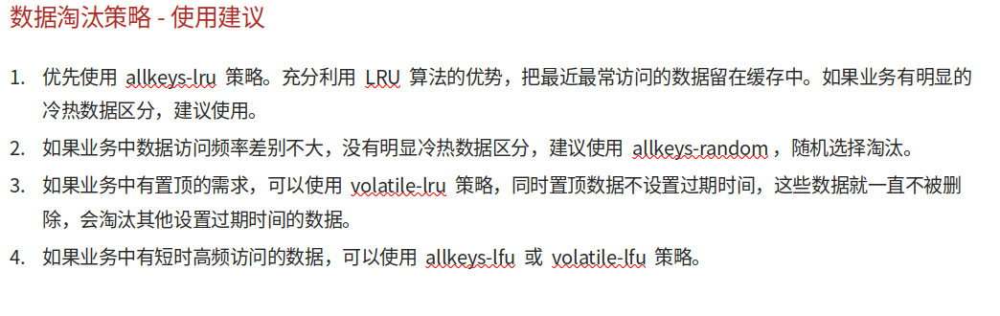
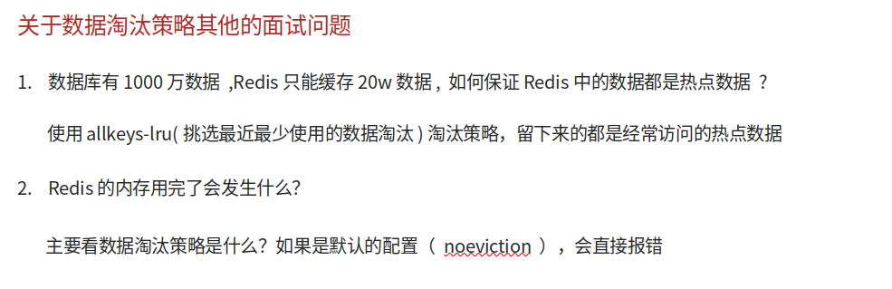

# Redis数据淘汰策略

## 自己理解

当Redis内存不够了，但还有新的请求向里面添加数据，这时就需要淘汰策略，来淘汰那些符合规则的数据，即使它们的Key值没有失效，一般有8种淘汰策略：1，默认禁止写入，noeviction；2，具有TTL(设置了Key值生效时间)的进行随机淘汰；3，具有TTl进行比较，谁TTl少谁淘汰；4，具有TTl进行LRU算法（最近最少使用）；5，具有TTl进行LFU（最近频率最小）算法淘汰；6，全局Key进行随机淘汰；7，全局Key进行LRU算法淘汰；8，全局Key进行LFU算法淘汰

## 网上笔记

