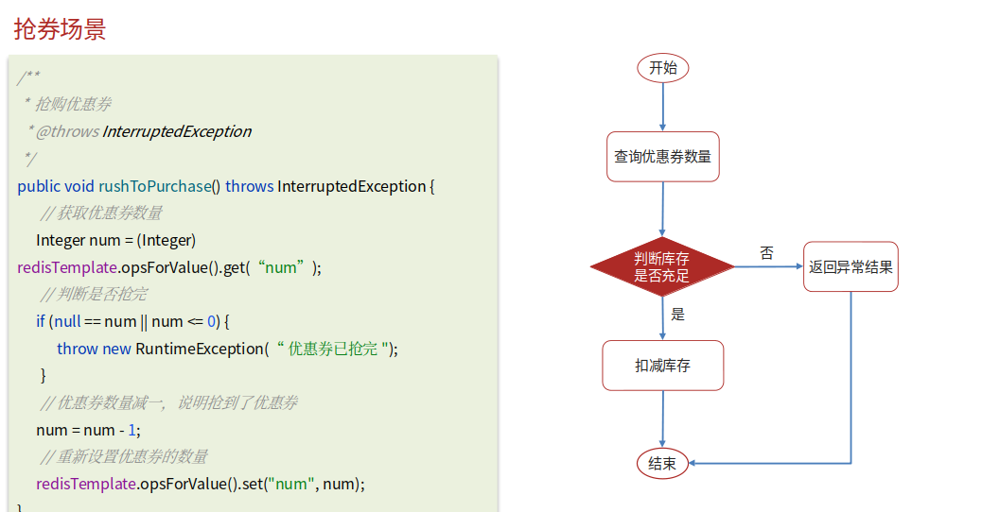
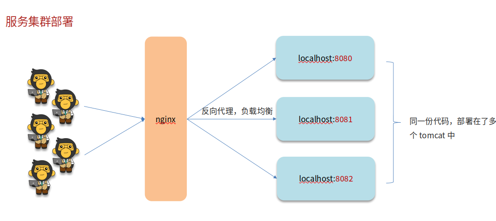
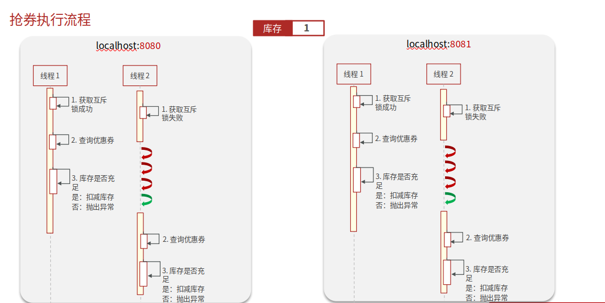
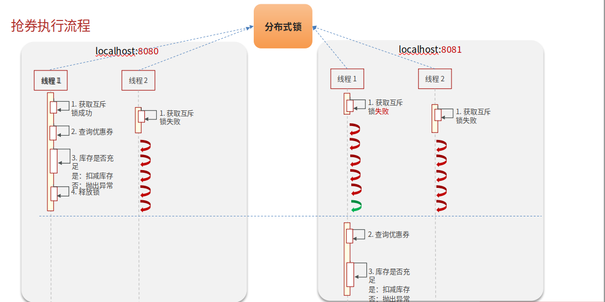

# Redis分布式锁

## 自己理解

为什么出现分布式锁？一个例子，当火车站卖票时有售票员甲和乙，这时来了两个人想买同一目的地的票，但票只剩一张，所以正常情况是无论甲还是乙登录售票系统提前把票拿走导致另外一位是没有票的，但不正常情况就是甲乙售票员同时点击了取票，导致机器都读取的是有一张票，这样就可能导致一人拿到真的票，另外一人拿到-1的票。然后我们进行扩展，重庆分别两个火车站AB的甲乙售票员同时出现了上述情况，四个人要购买一张同一目的地的车票，但为了避免出现同时读取到剩余一张票的情况，就得加锁，但这个锁不能单独在一个火车站里，所以就得在两个火车站上层提供一个锁，这个锁就得看是A甲，A乙，B甲，B乙中谁抢到就能正常售票，其他人只能等待是否退票了。将其形容一下就是分布式系统抢票了

## 网上笔记

错误情况

解决方法

