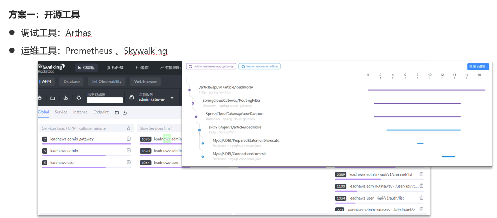
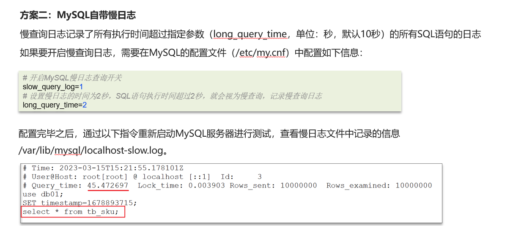

# MySQL定位慢查询

## 自己理解

先理解什么是MySQL慢查询？就是一次请求超过一定的时间才响应（一般都是5s），那么就需要想到出现了慢查询问题，那么如何定位慢查询？第一种使用一些测试工具，比如工具：Arthas ，Prometheus 、Skywalking，或者MySQL自带的慢日志查询

临时启用命令如下：

```powershell
set global slow_query_log=1	# 设置MySQL慢查询日志开启
set global long_query_time=2	# 设置MySQL查询超过时间2（默认单位s）的为慢查询
```

想要永久生效，就需要在配置文件 `my.cnf`/`my.ini`里直接添加了

配置完毕之后，通过以下指令重新启动MySQL服务器进行测试，查看慢日志文件中记录的信息 /var/lib/mysql/localhost-slow.log。



