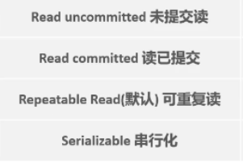
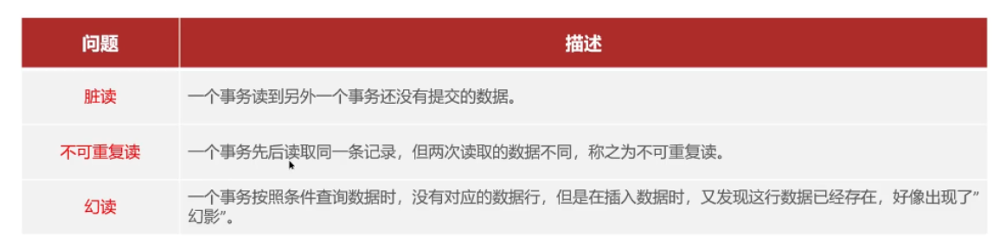
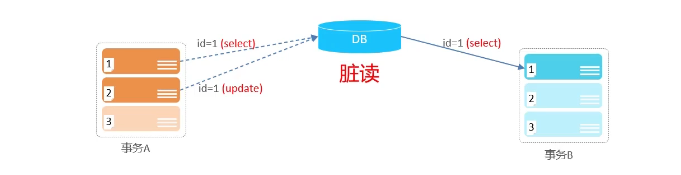
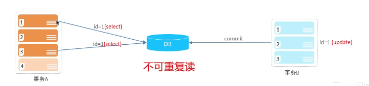
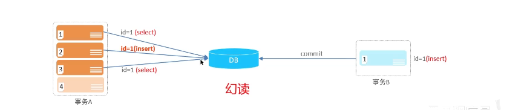
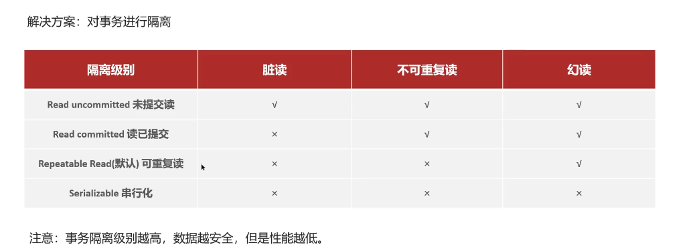

# 并发事务的问题，解决方法即隔离级别

## 自己理解

* 有哪些并发事务问题？：
  **脏读、不可重复度、幻读**
  * **脏读：**一个事务在操作时，读取了另外一个事务操作还没提交的数据
  * **不可重复读**：一个事务先后读取同一条记录，但两次读取的数据不同
  * **幻读**：一个事务按照条件查询数据时，没有对应数据行，但是在插入数据时，发现这行数据已经存在，好像出现了幻影
  
* 有哪些隔离级别呢？：
  

## 网上笔记

脏读

不可重复读

幻读

