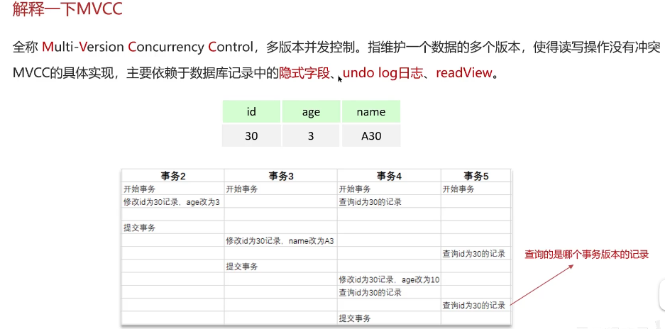
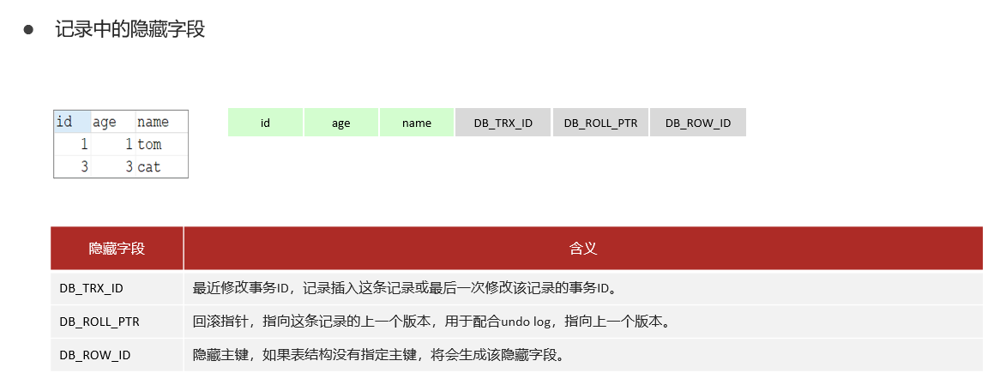
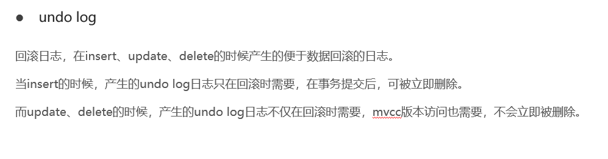
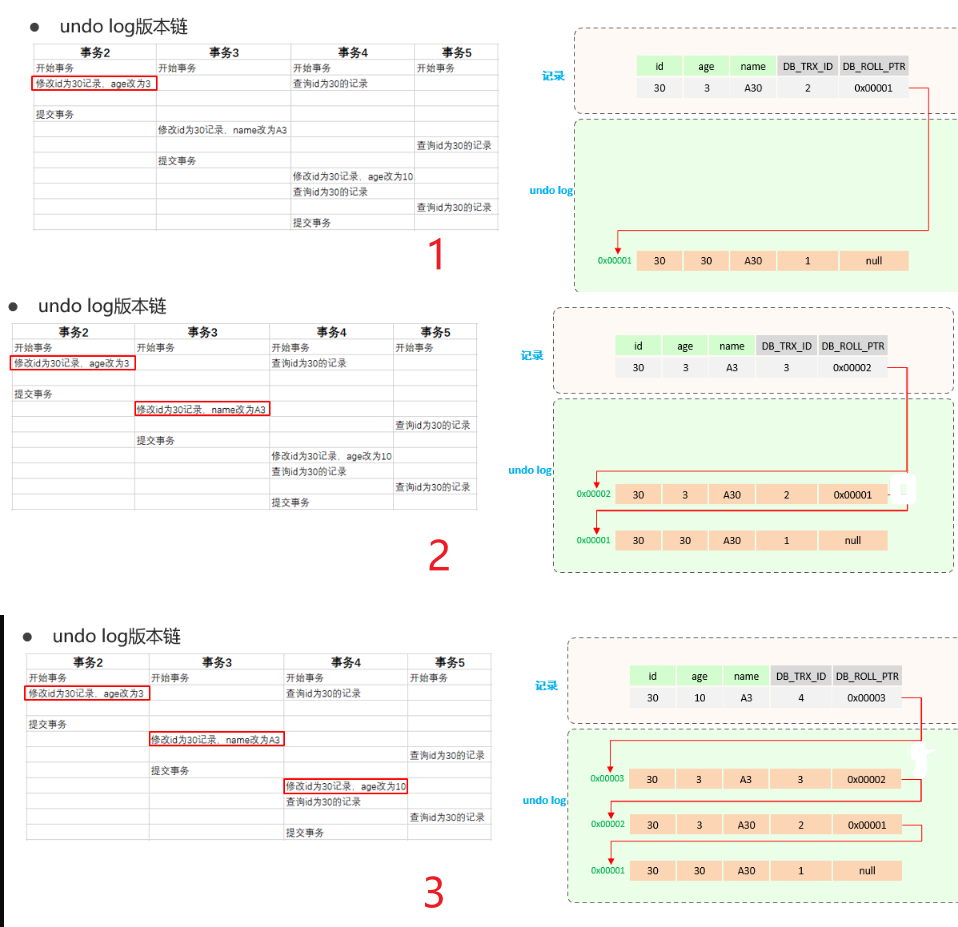
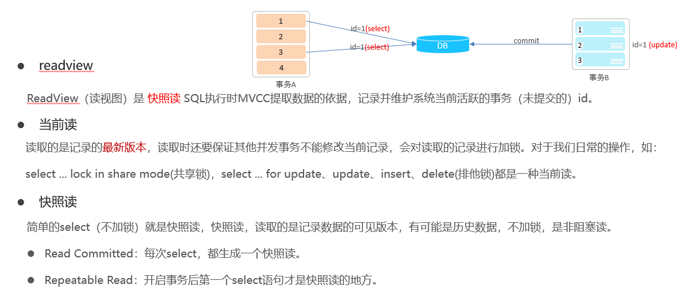
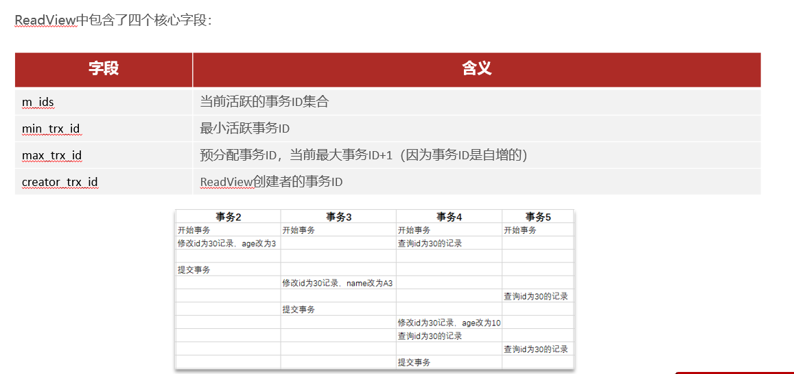
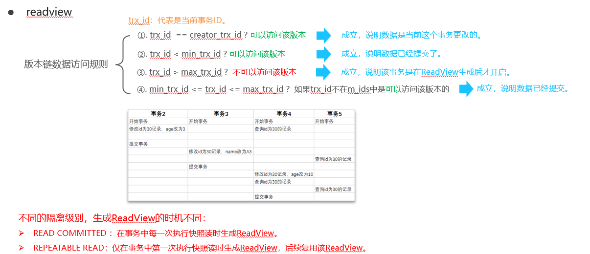
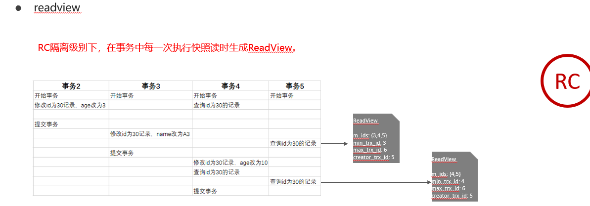
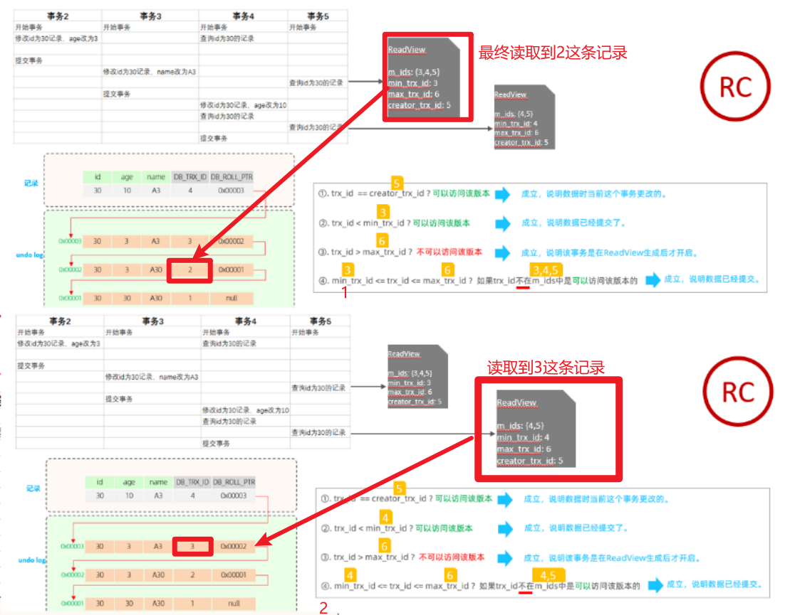
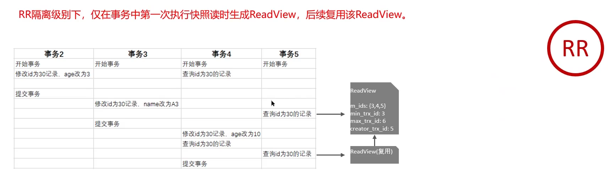

# 什么是mvcc？

## 笔记和理解

### 解释一下MVCC

**总结：**访问最近已提交事务的数据为准

>mvcc是多版本并发控制的英文缩写(multi-versioned concurrency control )，是用来解决多个并发事务的读写操作时不会出现错误的情况，**即下图中所示事务5查询的哪个事务版本记录的问题**

#### MVCC-实现原理

>MVCC实现需要**隐藏字段、undo log、readVIew**。
>
>①隐藏字段
>
>* DB_TRX_ID：最近修改事务ID，记录插入这条记录和最后一次修改这条记录的事务的ID
>* DB_ROLL_PTR：回滚指针，指向这条记录的上一个版本，和undo log配合
>* DB_ROW_ID：不重要，隐藏主键，若表没有指定主键这默认生成该字段形成一个主键

>②undo log 回滚日志
>
>11讲过，只有Insert,update,delete会产生，其中因为insert只有错误提交时回滚要用到undo log不会在mvcc里用到，所以事务提交后就可以删除，而update,delete不仅回滚要，mvcc也要不会立即删除

>不同事务或相同事务对同一条记录进行修改，会导致该记录的undolog产生一条记录版本链表，链表头部是最新的旧记录，链表尾部是最早的修改记录

>③readView
>
>是**快照读**SQL执行时mvcc提取数据的依据，记录并维护当前最活跃事务的id
>
>
>
>readview包含4个重要字段
>
>* m_ids：当前活跃事务的id集合。例子中处于事务5查询id为30的操作时，活跃事务有3,4，因为事务2已经结束了
>* min_trx_id：最小活跃事务id。同样的例子，则是3
>* mx_trx_id：不是最大活跃事务id，而是预分配事务ID，是最大活跃事务id+1（事务id都是自增的）。这里就是6
>* creator_trx_id：readview创建者的事务id，后面有例子
>
>
>
>**注意：trx_id是当前指向历史记录中的记录的trx_id**
>
>第3张图片规则不用记住，大概意思就是只有处于正在提交的活跃事务可以被访问

1

2

3，数据链访问规则

>当前事务的id即为creator_trx_id，和undo log链表里的DB_TRX_ID进行比对，符合数据链访问规则的记录则是当前读取的记录

1

