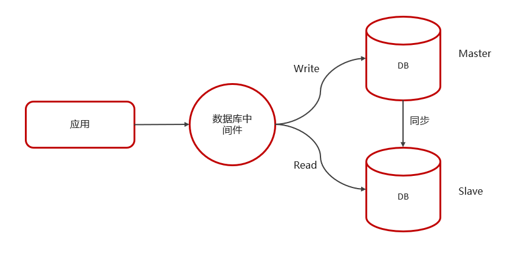
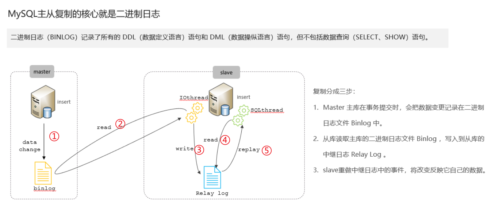

# MySQL主从同步原理

## 笔记和理解

### 主从同步原理

>核心在于binlog日志，即记录所有的DDL(数据定义)和DML(数据操纵)语句的二进制日志文件，就像Redis的aof一样
>
>
>
>**具体步骤5步**
>
>①：主数据库将所有DDL和DML写进binlog文件
>
>②：从数据库的IOthread线程读取主数据库的binlog文件
>
>③：从数据库的IOthread线程接着将binlog文件里的数据复制写到Relay log中
>
>④：从数据库的SQLThread线程进行读取Relay log日志的内容
>
>⑤：从数据库的SQLThread线程进行重复主数据库的操作就将数据复制了

