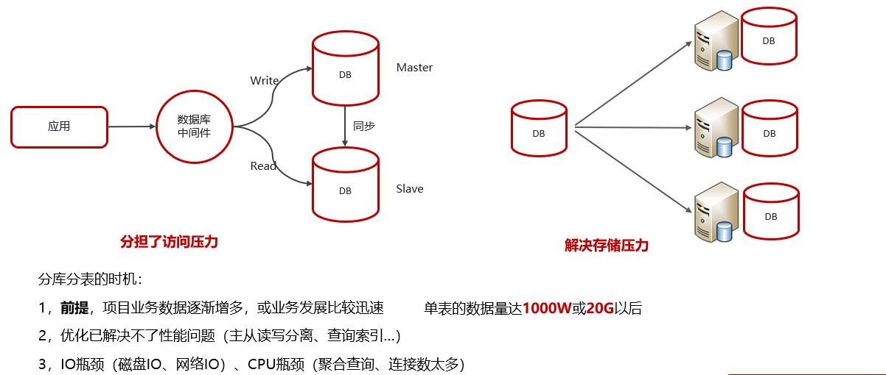
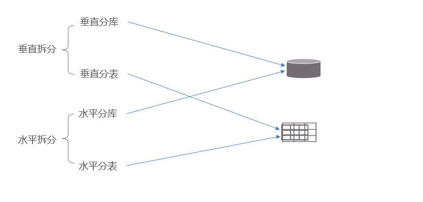
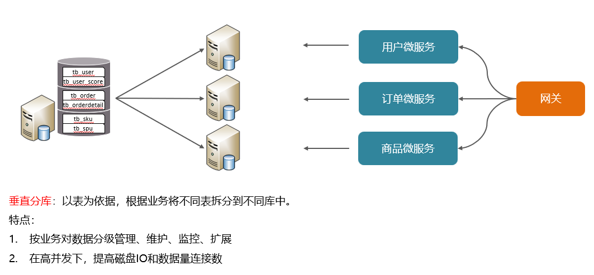
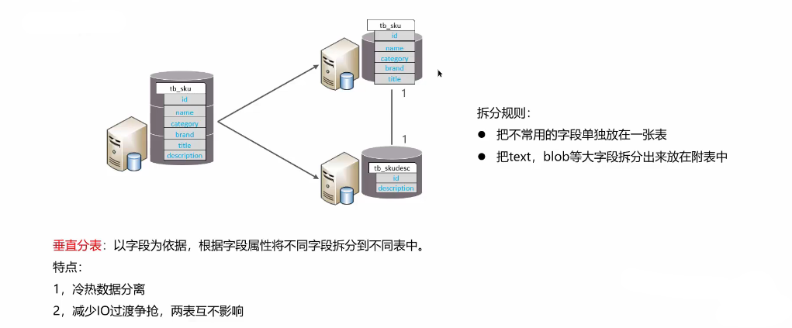
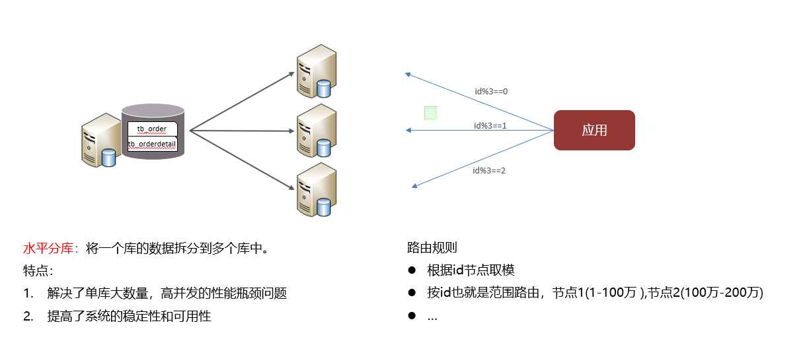
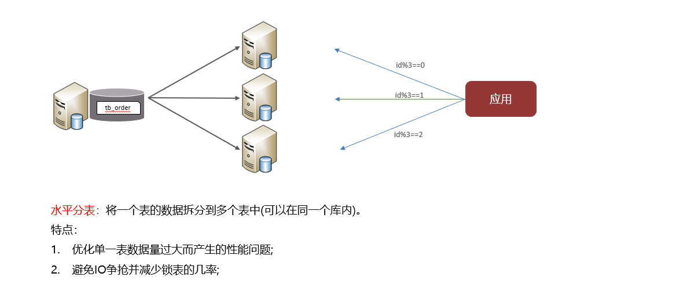
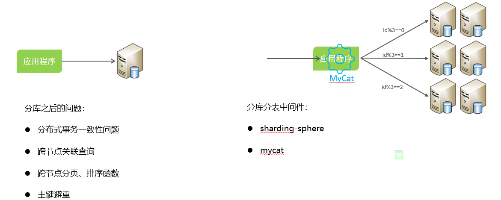

# 主库分库分表

## 笔记和理解

### 拆分策略

#### 垂直分库

>以表为依据，根据表的业务分类划分到不同的数据库里，即同类业务的表放到一个数据库里，另外的放到另外数据库里。
>
>
>
>具有在高并发情况下减少一个数据库的压力同时提高可访问量

#### 垂直分表

>根据字段为依据，根据属性不同将字段拆分到不同的表中去，**拆分依据一般以字段是否常用来划分，以及将大字段拆分**
>
>
>
>好处就是冷热数据分离，减少IO过渡争抢

#### 水平分库

>水平分库就只是分库，就是将一个数据库的数据拆分到多个数据库中，所有数据库的数据整合才是一个表的真实数据
>
>
>
>划分问题可以通过在处理数据时进行id取模，或者某些规则例如=》id的范围等进行数据的crud

#### 水平分表

>这个记住就是将一个表拆分到多个表中，每个表可以按照一定规则取名即order_1,order_2等，这些表可以在同一个数据里也可以在不同数据库里，你可以通过创建一个目录来找到对应表

#### 分库分表产生的问题（不用管）

### 总结

**垂直类似微服务，水平类似分片**

