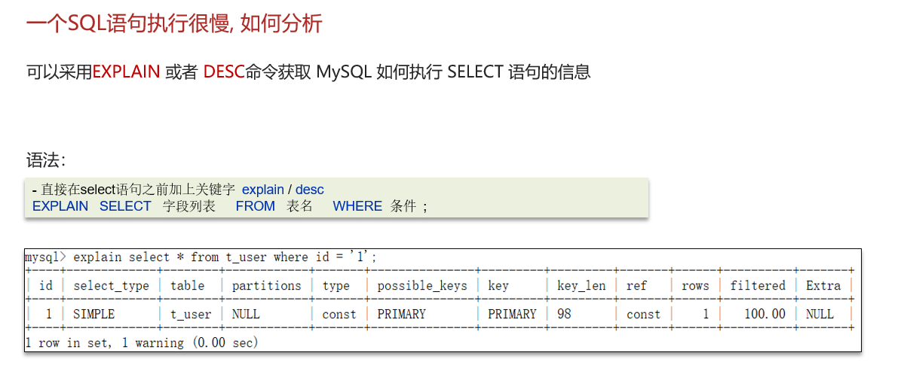
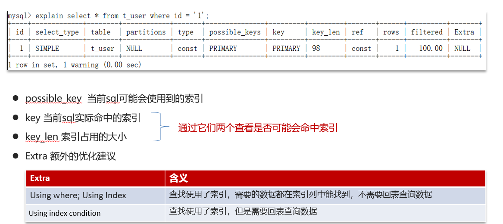
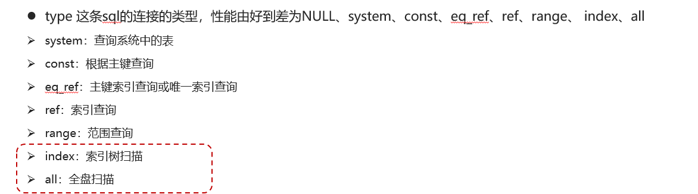

# MySQL的SQL语句执行很慢，该怎么解决呢？

## 自己理解

聚合查询 =》新增临时表

多表查询 =》优化Sql语句结构

表数据量过大查询 =》添加索引

使用explain(解释)或desc(-description描述)命令获取详细的SQL语句查询，我们通常检查key和key_len属性的值，以及type对应的值从好到低是：null,system,const,eq_ref,ref,range，后面两个绝对不能出现，出现就有问题了index【索引树扫描】和all【全盘扫描】

## 网上笔记

