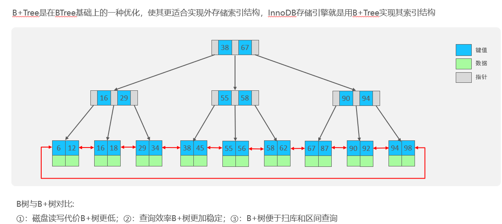

# MySQL优化，索引以及索引的数据结构

## 自己理解

索引就像给数据库里的数据添加一个关键词目录，如字典的前面几页的目录，然后其作用就是为了提高查询效率，当然关键词要高频出现，能够快速定位主题才好。MySQL使用InnoDB引擎，其内部索引数据结构就是B+树，相比于B树，其优点就是非叶子节点不存数据，只存指针，占用空间就小，这样硬盘读取会更快；B树就是不管叶子还是非叶子节点都会包含数据，所以占用空间就大。此外B+树由于叶子节点是双向链形式便于扫库和区间查询，即找到100号叶子，想找102不需要像B树重新从根扫描到叶子，而是顺着100号节点的链子向下查询100=》101=》102

## 网上笔记

