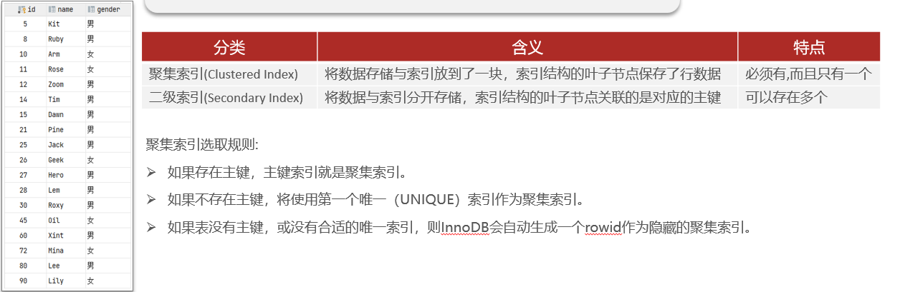
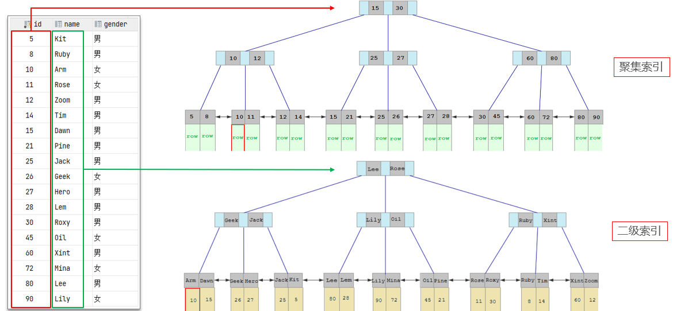

# MySQL优化，聚簇索引和非聚簇索引以及回表查询

## 自己理解

聚簇索引和非聚簇索引的解释，聚簇索引一般都是数据库表的主键，所以也叫主键索引；如果没有主键，就找建表时使用了`unique`的键，实在没有innodb会自创一个类似id的主键，然后呢=》对应的数据结构B+树的叶子节点上存储的都是id键值以及表一行的数据。而非聚簇索引又叫二级索引，可以有多个，一般都是存储的都是当前列的键值+对应的主键id列的键值。这样就引出了**回表查询**，例如下列sql语句`select * from student where name="张三"`而我呢，为name建立了一个非聚簇索引，id作为主键是聚簇索引，那么查询知道有索引的情况下会优先使用非聚簇索引name，然后在对应B+树找到对应叶子节点查询到了对应主键的键值，再回表查询主键的聚簇索引，找到对应一行的数据。

## 网上笔记

