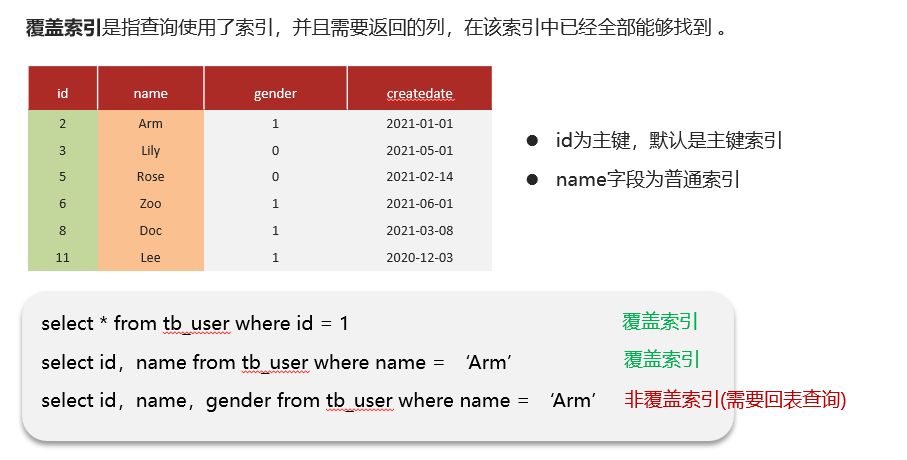
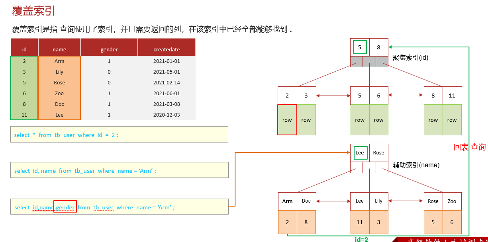
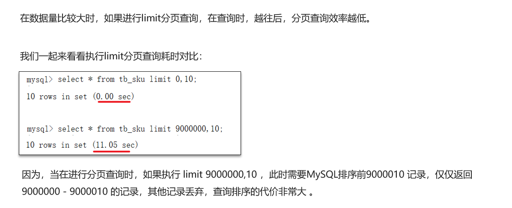
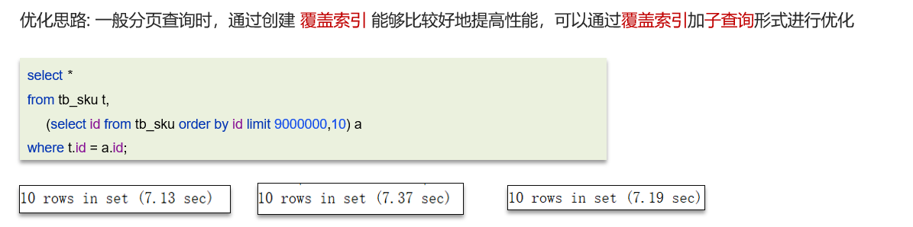

# MySQL覆盖索引，超大分页优化查询

## 自己理解

先谈谈什么是覆盖索引，简单点就是不进行回表查询的就是覆盖索引，但真实是进行索引查询时所需要的列信息在索引的B+树数据结构中能够获取得到【】，一般进行主键索引查询都是覆盖索引，而二级索引查询一般都是所需列为二级索引的列键值和id的键值，例如 =》select id,name from student where name="张三"，其中id为主键，name为建立的二级索引的列，所以上述就是覆盖索引，而=》select id,name,age from student where name="张三" 就不是覆盖索引，因为它第一次通过二级索引查询就只能获得id和name，仍需回表查询才能获得age

再谈谈超大分页查询的优化方案，进行子查询+覆盖查询来优化，例如=》select * from tb_sku limit 9000000,10 就可能需要10s时间查询，但可优化为=》select * from tb_sku a,(select id from tb_sku limit 9000000,10) b where a.id=b.id; 先进行子覆盖查询，再进行回表的聚簇索引查询，大概只需7s时间

## 网上笔记

超大分页处理

