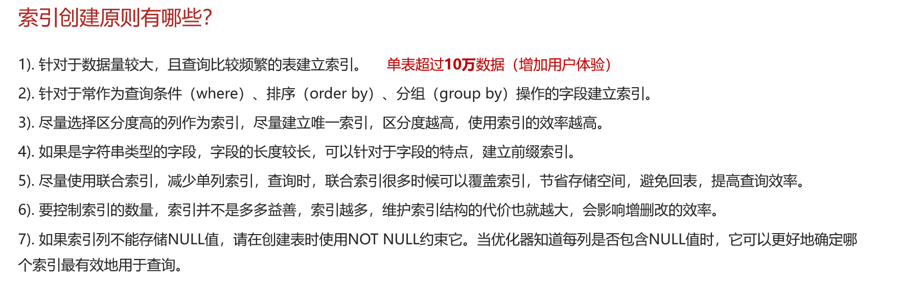

# MySQL之索引创建原则

## 自己理解

MySQL索引创建原则有7条，但有4条很重要：1.这个表的数据量很大（10万条数据），查询比较繁琐；2.这个表中经常被查询，排序（order by），分组（group by）的进行建立索引；3.尽量使用联合索引【可以覆盖索引，减少空间，避免回表，提高查询效率】；4.尽量别创建太多索引【索引越多，维护越繁杂，增删改效率就会越低】，额外三条随便记了：1.字段内容区分度高、2.内容较长，使用前缀索引、3.如果索引列不能存储NULL值，请在创建表时使用NOT NULL约束它

## 网上笔记

