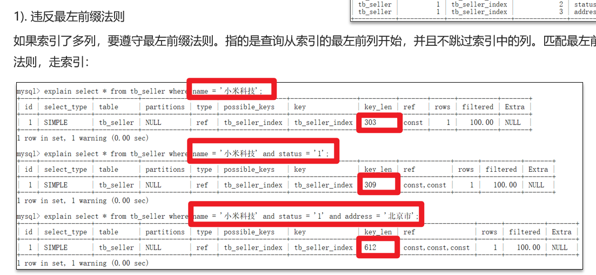
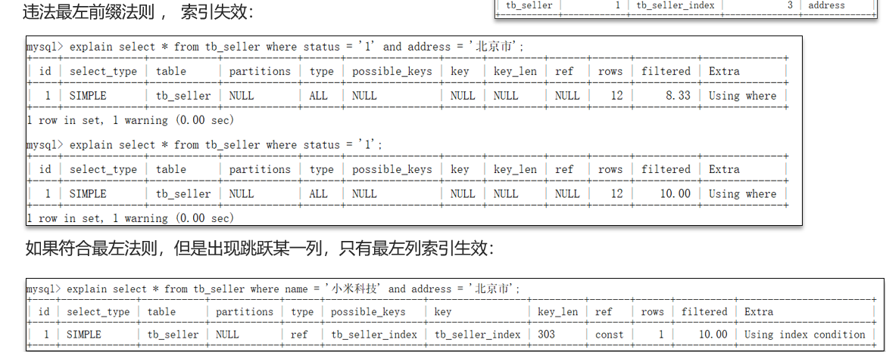
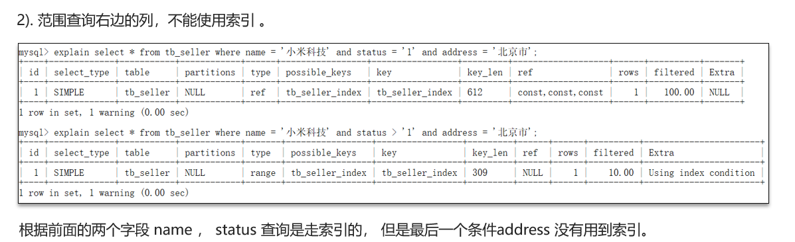
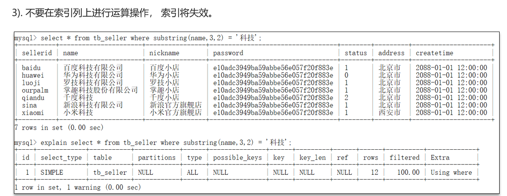
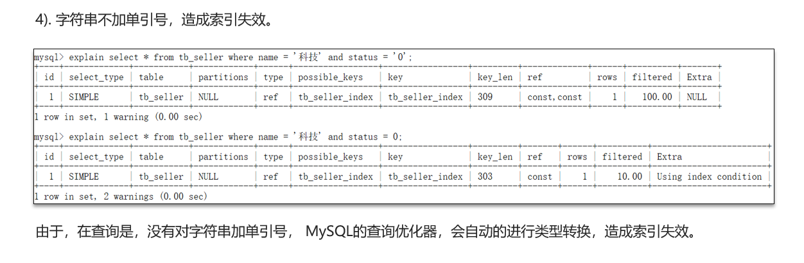
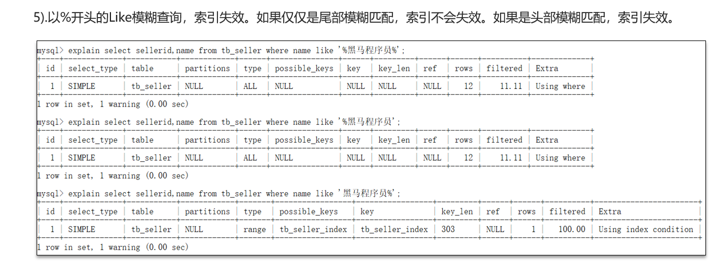

# MySQL什么时候索引会失效

## 自己理解

什么时候索引会失效，1.首先得知道sql语句的索引遵守最左前缀法则，即联合索引/复合索引在创建时，就会规定属性列的顺序，如果sql查询语句的第一个条件不是联合索引创建时第一个列，那么索引会失效；2.出现了比较的索引列，右边剩余索引列会失效；3.在索引列上进行了运算，那么索引列会失效；4.字符串不加`''`会失效；5.模糊匹配的最左边出现%会失效

## 网上笔记

**正常情况如下**

违反一条

