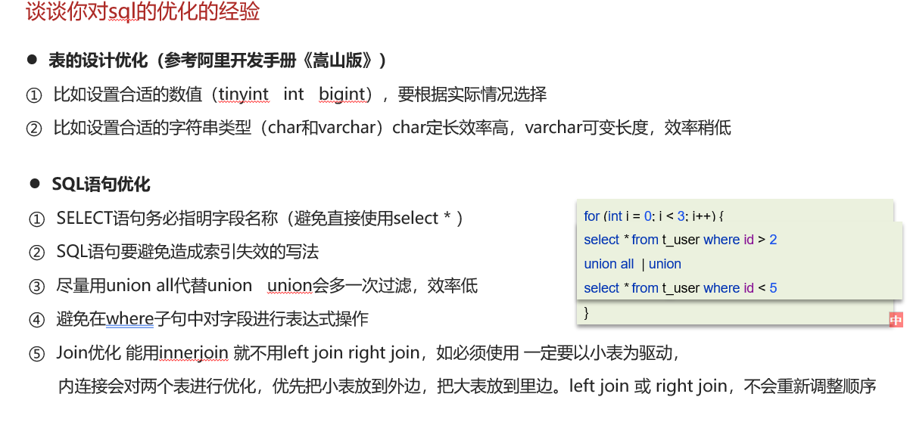
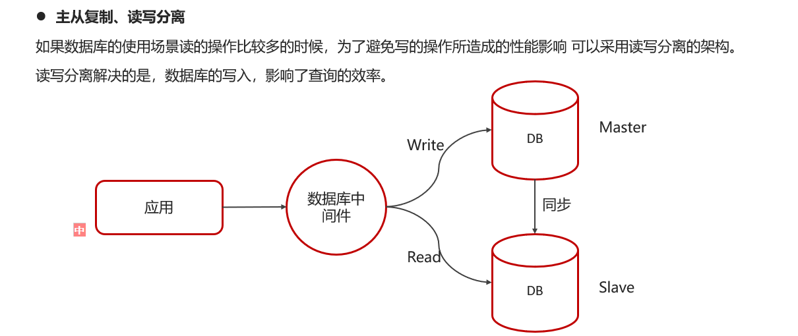

# 对SQL优化的经验

## 自己的理解

对SQL进行优化可以从如下3方面入手：

1.对表的优化，

​	①参考阿里开发手册，可设置合适的数值tinyint，bigint，int等，

​	②此外字符串可选char，varchar，char定长的话效率更高；

2.对SQL语句的优化，

​	①尽量不使用`select *`语句毕竟可能导致不能覆盖索引，效率就低了，

​	②然后就是能够引起索引失效的不要使用

​	③尽量使用union all而不是union，union的作用是将两个查询结果合并，union all就是不做处理，有重复项就显示重复项，例如=》

```sql
select * from t_user where id > 2
union all  | union
select * from t_user where id < 5
```

​	④避免在where子句中对字段进行表达式操作

​	⑤Join优化 能用innerjoin 就不用left join right join，如必须使用 一定要以小表为驱动，

   内连接会对两个表进行优化，优先把小表放到外边，把大表放到里边。left join 或 right join，不会重新调整顺序

3.主从复制，读写分离

​	就是将读写的执行分开，再同时利用同步技术保证主从的数据同步，同Redis主从复制问题


## 网上笔记



