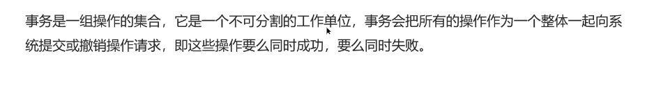
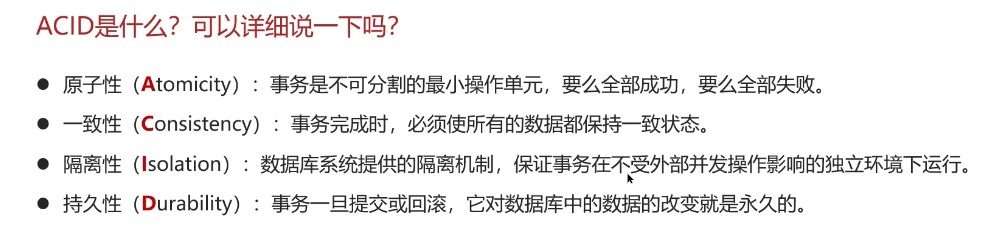

# 事务的特性

## 自己理解

* **理解事务**：
  什么是事务？事务是一组操作的集合，是不可分割的最小单位，事务会将所有操作作为一个整体向系统进行提交或撤销操作，所有操作要么都成功，要么都失败

* **理解ACID**:
  * A(Atomicity)原子性：事务是最小的单位，事务的操作要么都成功，要么都失败
  * C(Consistency)一致性：事务完成时，必须让所有的数据保持一致状态，或者说是符合某条规则
  * I(Isolation)隔离性：数据库系统提供的隔离机制，保证了事务操作会处于独立环境运行，不会受到外部并发操作影响
  * D(Durability)持久性：事务一旦提交或撤销，他对数据库的数据的改编就是永久的

可以以黑马提出的案例转账案例来讲解

**张三和李四都有3000，张三向李四转账1000元**，事务操作是，张三的余额扣除1000，数据改为2000，李四的余额增加1000，数据改为4000。此事务的所有操作要么都完成，要么都失败。不能存在张三余额扣除了，数据变了，但李四余额没增加情况，体现**原子性**；此外相互转账，那么就会有条规则即总额不会改变，那么张三向李四转账后总金额也不会改变这是**一致性**；然后该事务操作可模拟为银行向两人提供专门交易间，他们两只有事务做完后才能出来，当然结果可以成与不成，体现**隔离性**；而一旦交易完成后，各自的余额就固定了，这是**持久性**

## 网上笔记

