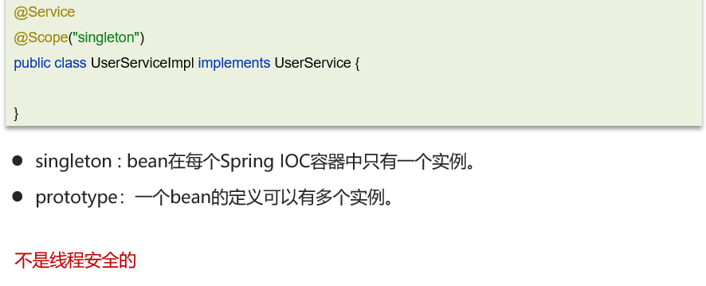
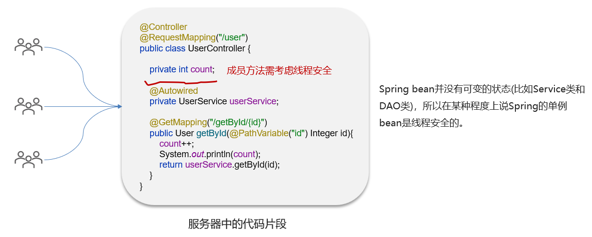

# 单例bean是线程安全的吗？

## 笔记和理解

>Spring里的bean默认会有@Scope("singleton")即单例的，但可以通过prototype更改为多例

### 为什么不安全？

>在下面例子中普通的成员的属性方法需要考虑线程安全问题，而单例bean即userService是一种**无状态**的bean即UserService类里的变量和属性不会发生改变，可以说单例bean在某种情况下是线程安全的

### 总结

**如果一个bean内定义了可修改的成员变量，那么他就不是线程安全的，就得考虑加锁或使用多例了**