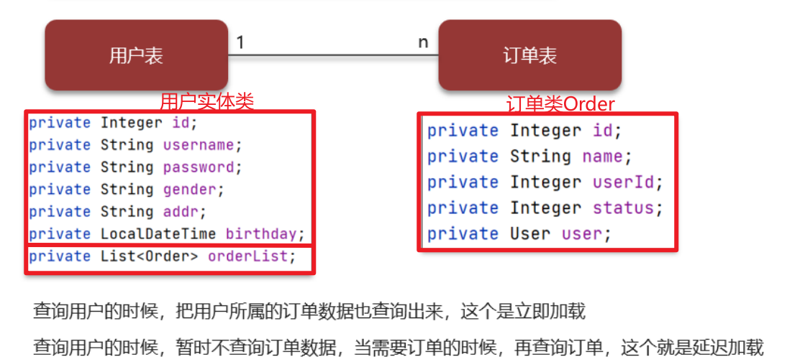
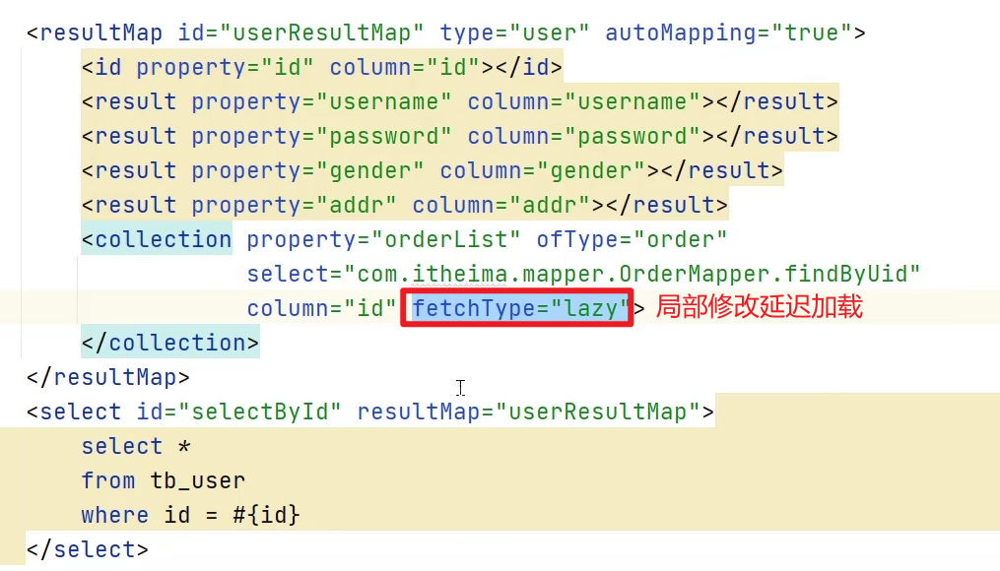
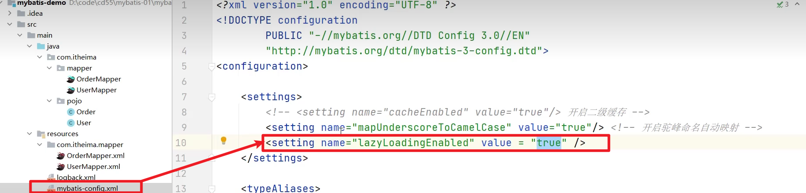
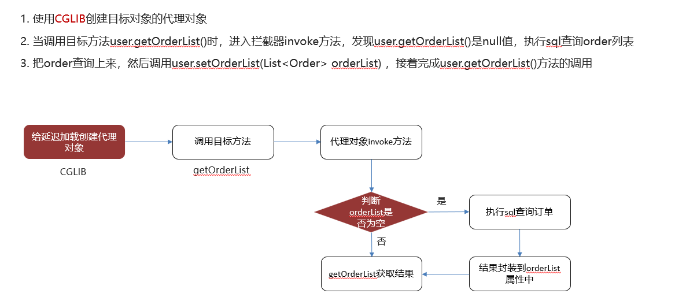
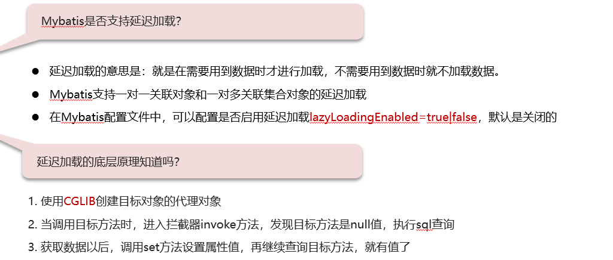

# Mybatis所支持的延迟加载

## 笔记和理解

### 什么是延迟加载？

>mybatis是有延迟加载的，但是默认关闭的
>
>立即加载：以下面为例，在查询了用户信息的时候，也把订单数据一起查询了，这就是**立即加载**
>
>延迟加载：同样的例子，在查询了用户信息后，先不查询订单数据，只有要用到了再去查询，这就是**延迟加载**，也叫**按需加载**

**局部延迟加载**

**全局延迟加载**

>在mybatis-config.xml文件的\<settings>里添加

### 底层实现原理

### 总结

