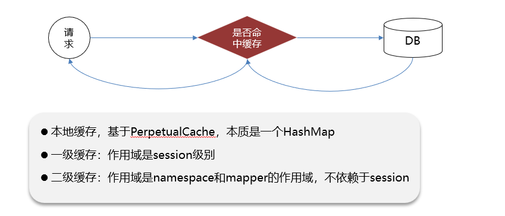
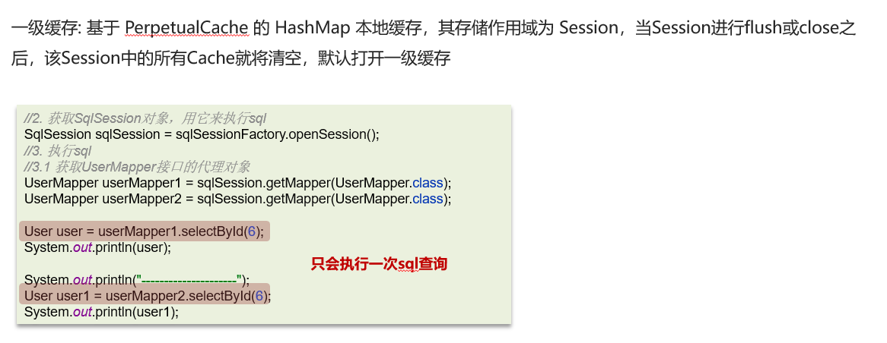
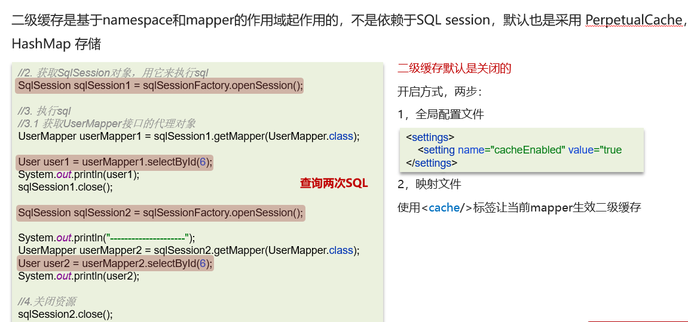
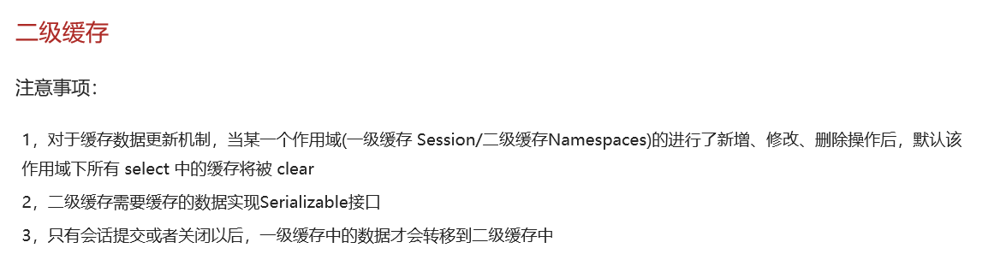

# Mybatis一级，二级缓存

## 笔记和理解

### 简介

>mybatis有三种缓存
>
>本地缓存，由PerpetualCache类为主，本质是一个HashMap
>
>一级缓存，作用域是session级别
>
>二级缓存，作用域是nameSpace和mapper，不依赖session
>
>不同作用域数据保存时机不同

#### 一级缓存 

>一级缓存基于Session所以如果使用的SQLsession相同则不会再次查询，除非使用了flush或close

#### 二级缓存

### 总结

