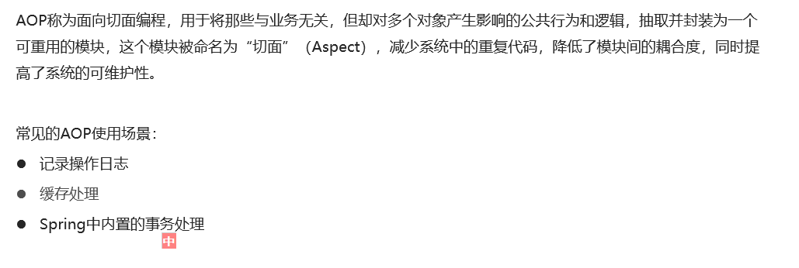
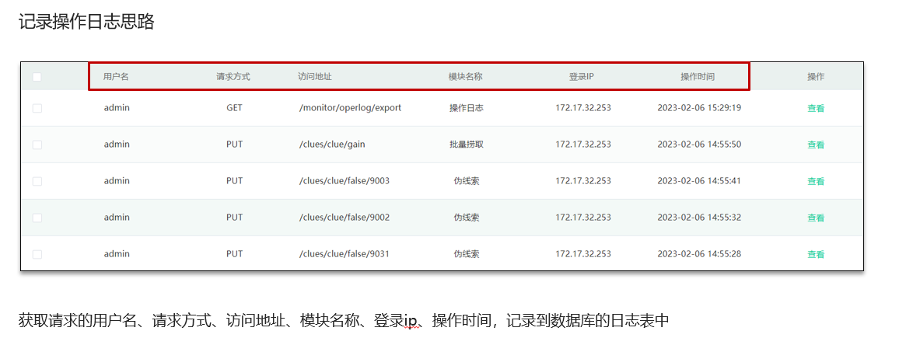
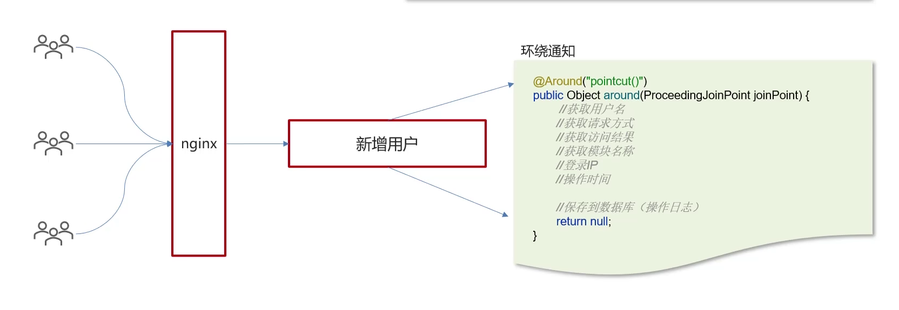
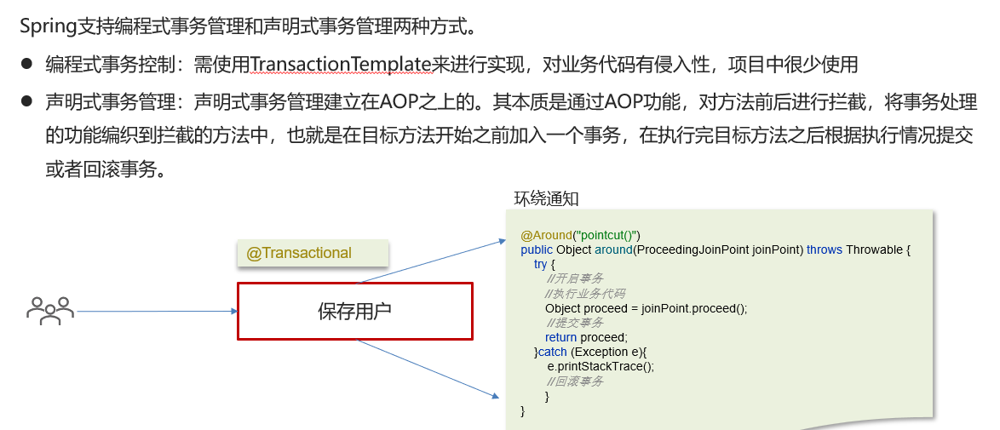
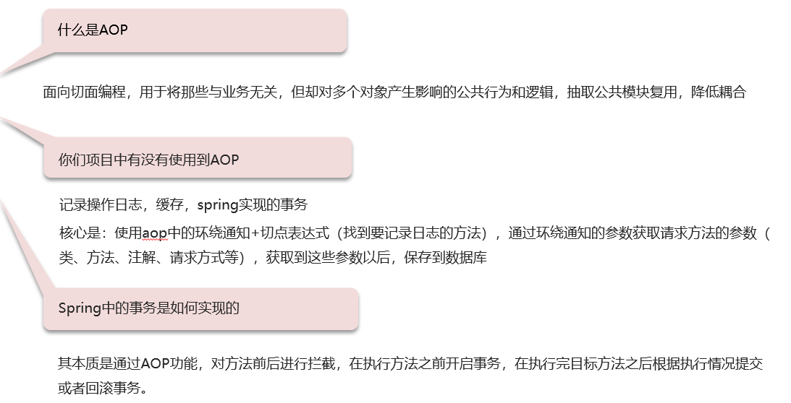

# AOP相关问题

## 笔记和理解

>**自己理解：**AOP即Spring中切面编程，即在流线型代码中间切开，插入一部分可重用的具有公共行为和逻辑的代码，这样可减少重复代码，降低模块间的耦合度
>
>
>
>AOP常常用在记录操作日志，缓存处理，事务处理

### 什么是AOP，是否用过AOP

>这里举个例子：在我们代码里我们有时候需要记录前端向后端发送请求的记录，包括请求的用户，请求方式，访问地址，访问模块等信息，这些信息不一定在一个类里，而每个类里添加一个记录的方法或成员属性都会让代码量增加，那么就可以想到AOP技术

### Spring中的事务是如何实现的

>重要的记住声明式事务，在方法执行前后进行拦截，即方法执行前启动事务，方法执行结束后拦截事务

### 总结

**黑马老师讲的很不错，这点记住AOP一个重要实现就是日志记录，使用环绕通知方法和切点表达式方法，通过环绕通知方法的参数即切点表达式来获取被切方法的一些信息，然后保存数据库**

最好使用一个例子来理解这个AOP，AOP已经遇到3遍了

