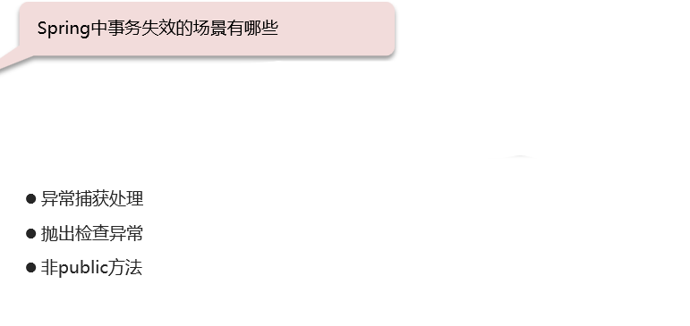
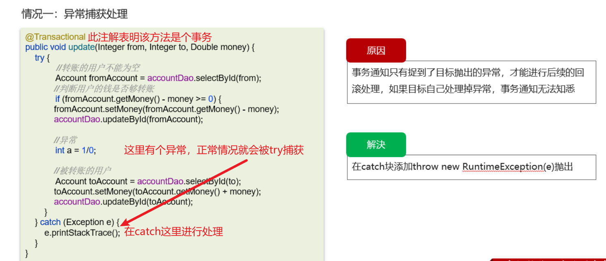
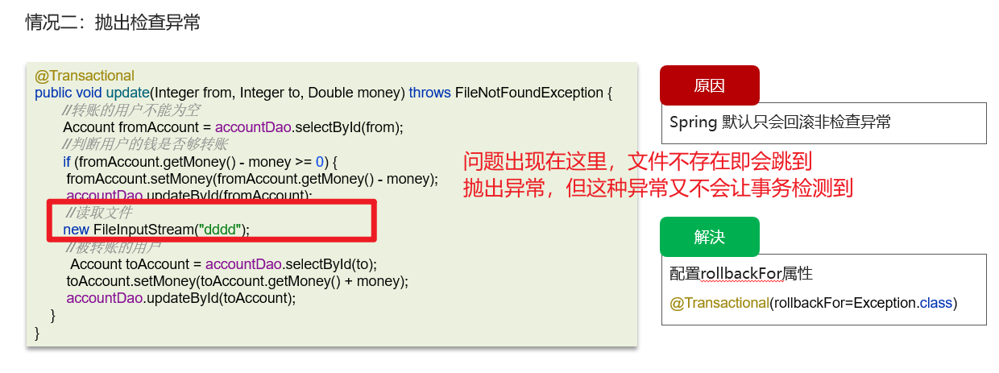
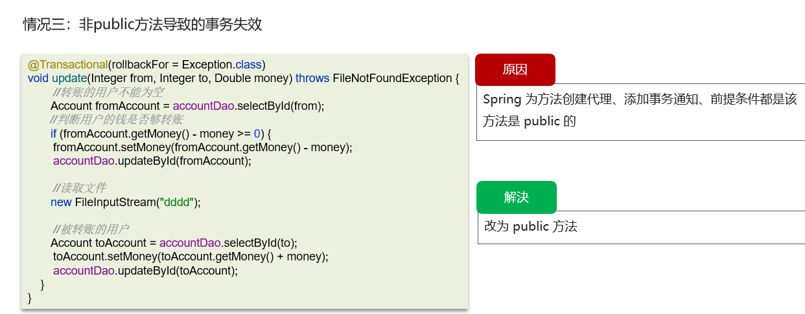

# Spring事务失效的场景

## 笔记和理解

### 总结

除了第三个垃圾一个，前两个都比较重要  

### 事务失效场景

>异常处理
>
>抛出检查异常
>
>非public方法

#### 异常捕获处理

>如下=》转账方法的代码是一个事务，try。。。catch会将错误在代码内部就进行处理，这样就会出现前半部分代码执行了，就跳转到错误处理，而不会抛出异常，导致代码认为这个事务正常，就不会回滚。就会出现扣钱了，但转账没成功结果，导致事务不会回滚
>
>
>
>**解决方法**：在catch代码里再抛出一个异常

#### 抛出检测异常

>由于Spring事务默认只检测非检查型异常，所以像文件检测就会导致抛出异常，但事务不回滚
>
>
>
>**解决方法：**给@Transactional添加rollbackFor属性=Exception.class即可

#### 非Public方法导致的事务失效

