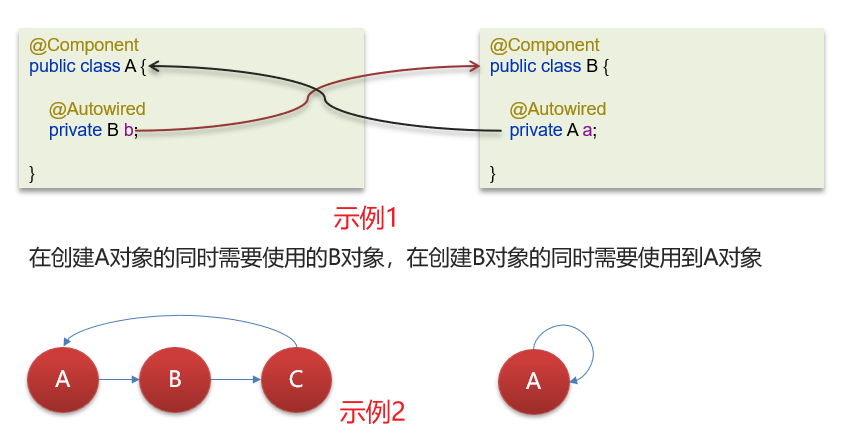
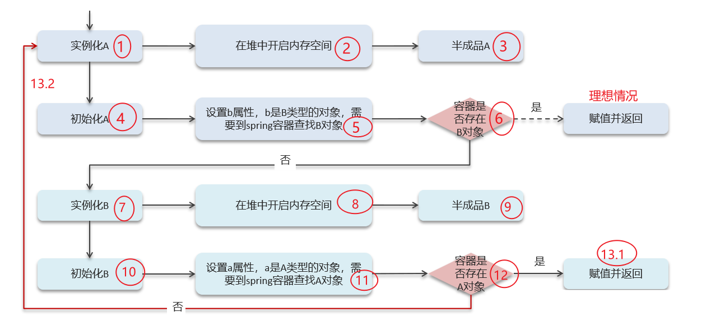
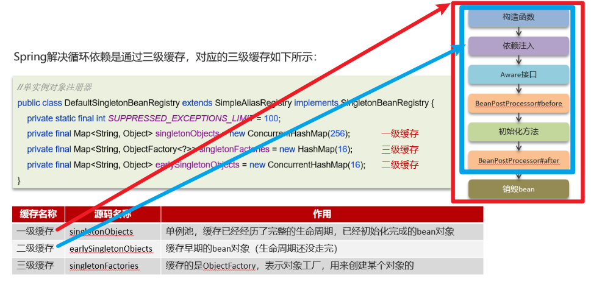
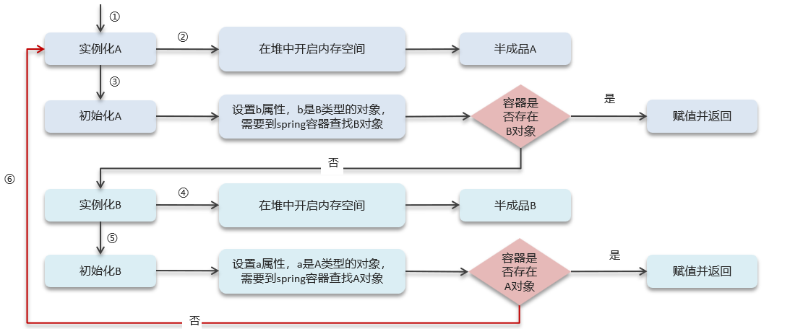
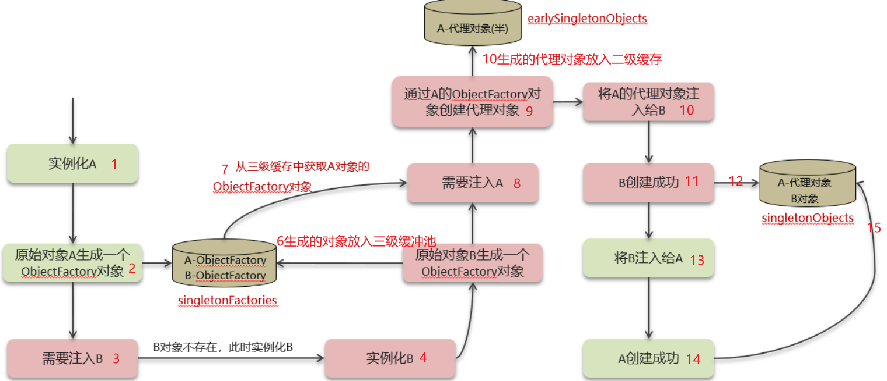
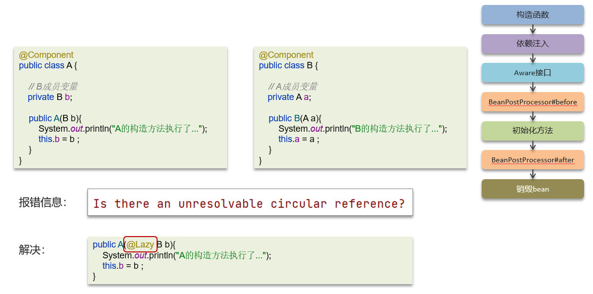

# Spring中的循环依赖

## 笔记和理解

>现象解释=》如下图，示例1中A类依赖B类，B类依赖A类，它们两者相互引用
>
>示例2中A依赖B，B依赖C，C依赖A，就会导致最后其实是A依赖于自己的现象发生

### 什么是Spring的循环依赖

>以示例1讲解为什么出现了循环依赖，分别从步骤1到步骤12，最后在步骤13处出现分支，因为B依赖A的对象，而A的对象又因为依赖B的对象导致没有形成，所以B也失败，也就进入13.2循环了

### 利用三级缓存解决问题

>一级缓存**singletonObjects**存放的就是完整走过bean生命周期的bean，红色方框里的
>
>二级缓存**earlySingletonObjects**则存放就没有走完的，或早期的bean对象即没有执行到销毁Bean的步骤
>
>还有一个三级缓存**singletonFactories**

**只有1级缓存**

>如果以只有一级缓存解决示例1，可以看到因为只存放完成生命周期的bean导致A，B都不会放到一级缓存中去，就导致这个问题没法解决

**多增2级缓存**

>多增一个二级缓存
>
>循环问题就得到解决，步骤如下

**三级缓存解决流程**

>拥有三级缓存可以按照下列的方式完成循环依赖问题

### 构造方法出现循环依赖问题

>由于三级缓存只能解决初始化部分循环依赖问题，构造函数板块出现循环依赖得依靠@Lazy注解，即懒加载注解即可

