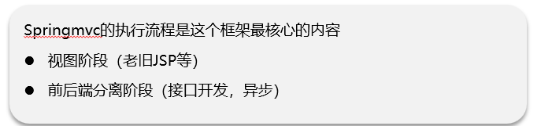
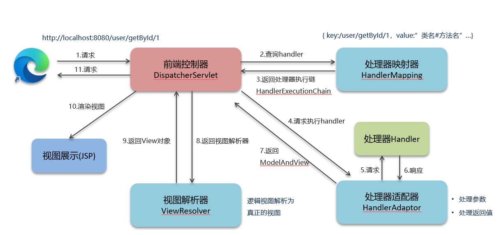
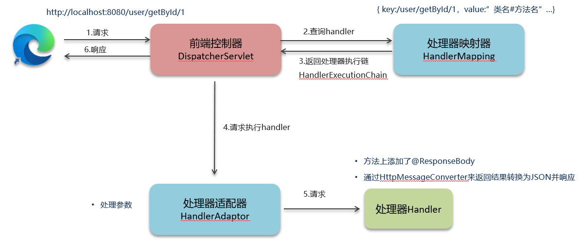

# SpringMVC执行流程

## 笔记和理解

>SpringMVC执行流程有两个阶段，
>
>阶段1是老版本的JSP技术，只需了解即可；
>
>阶段2则是前后端分离阶段，使用了异步开发，接口调用的形式

#### 视图阶段（JSP技术）

>有些面试官会问SpringMVC的组件有哪些，就是下面四个即前端控制器，处理器映射器，处理器适配器，视图解析器。它们的在mvc执行过程中起的作用是
>
>1.浏览器发送请求，例如=》http://localhost:8080/user/getById?id=1。**前端控制器**接收请求
>
>2.前端控制器向**处理器映射器**发送查询请求，即从处理器映射器map中找到链接对应的**类中的方法名称**，将参数，类名等进行处理打包返回
>
>3.处理器映射器返回查询到的结果handlerExecutionChain
>
>4.前端控制器得到处理器映射器那里想要的结果后，将打包发送给**处理器适配器**
>
>5.处理器适配器根据打包的内容中的参数信息，方法名称找到对应方法（处理器），将参数适配到入参中去【这一块就可能需要适配了，得到的可能是字符串，但要求是User类】
>
>6.处理器进行处理后将返回值返回给适配器
>
>7.处理器适配器再将返回结果交给前端控制器
>
>8.前端控制器将返回结果又交给视图解析器
>
>9.**视图解析器解析后**返回View对象
>
>10.前端控制器根据View对象渲染视图
>
>11.前端控制器返回给浏览器渲染后的视图

#### 前后端分离阶段

>前面5步都和jsp差不多，只不过在后面进行了简化
>
>1.浏览器发送请求，例如=》http://localhost:8080/user/getById?id=1。**前端控制器**接收请求
>
>2.前端控制器向**处理器映射器**发送查询请求，即从处理器映射器map中找到链接对应的**类中的方法名称**，将参数，类名等进行处理打包返回
>
>3.处理器映射器返回查询到的结果handlerExecutionChain
>
>4.前端控制器得到处理器映射器那里想要的结果后，将打包发送给**处理器适配器**
>
>5.处理器适配器根据打包的内容中的参数信息，方法名称找到对应方法（处理器），将参数适配到入参中去【这一块就可能需要适配了，得到的可能是字符串，但要求是User类】
>
>6.处理器会在添加了@ResponseBody的方法执行后，将返回结果交予HttpMessageConverter处理转为Json直接交给前端响应，由前端服务器进行渲染展示在浏览器上面

