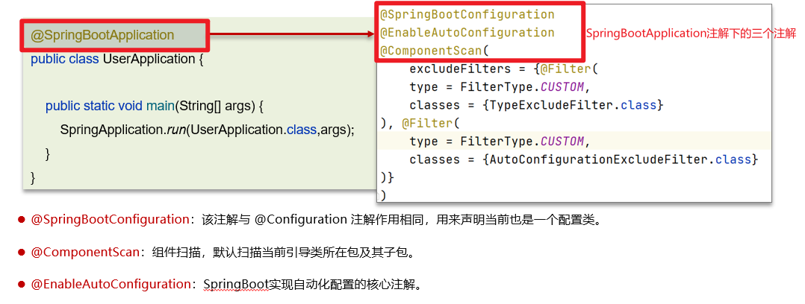
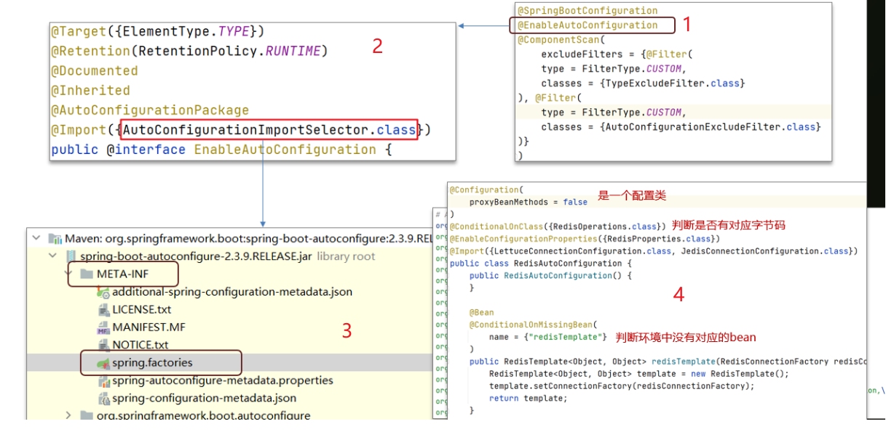

# SpringBoot中自动配置的原理（高频）

## 笔记和理解

>SpringBoot应用中常常看到@SpringBootApplication注解，它是三个注解组合起来的复合注解，包括
>
>@SpringBootConfiguration：和@Configuration相同，声明该类是配置类
>
>@ComponentScan：扫描当前包及其子包下的配置类和bean类
>
>**@EnableAutoConfiguration：**实现Springboot自动配置的核心注解

### EnableAutoConfiguration注解

>EnableAutoConfiguration注解通过@Import注解导入对应配置选择器即该项目的jar包下的classpath路下的META-INF/Spring.factories文件所配置类的全部(Spring2.7的)
>
>
>
>其中@EnableAutoConfiguration是实现自动化配置的核心注解。 该注解通过@Import注解导入对应的配置选择器。
>
>内部就是读取了该项目和该项目引用的Jar包的的classpath路径下META-INF/spring.factories文件中的所配置的类的全类名。 在这些配置类中所定义的Bean会根据条件注解所指定的条件来决定是否需要将其导入到Spring容器中。
>
>条件判断会有像@ConditionalOnClass这样的注解，判断是否有对应的class文件，如果有则加载该类，把这个配置类的所有的Bean放入spring容器中使用。

