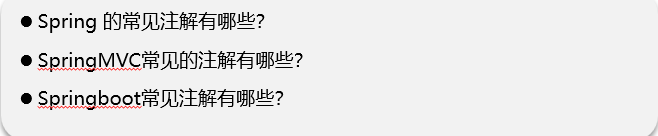
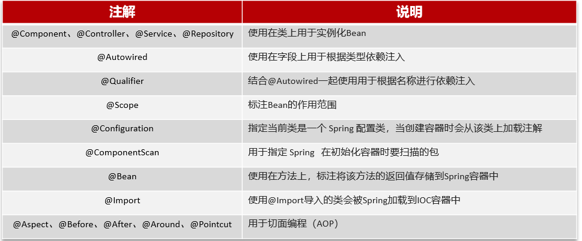
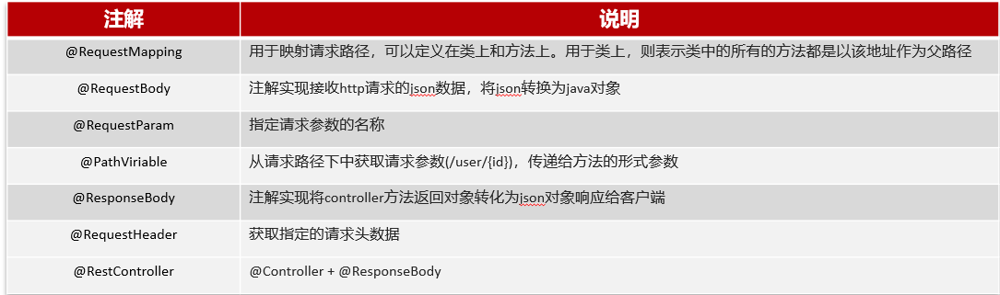
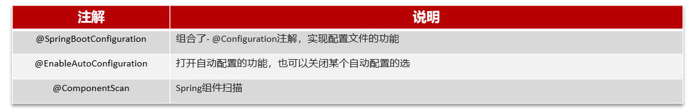

# Spring框架中常见注解

## 笔记和理解

>分为
>
>Spring中常见注解
>
>SpringBoot中常见注解
>
>SpringMVC中常见注解

这些注解可看注解篇

### Spring中常见注解

>@Component,@Controller,@Service,@Repository,@Autowired,@Qualifiter,@Scope,@Configuration,@ComponentScan,@Bean,@Import,@Aspect,@Before,@After,@Around,@Pointcut

### SpringMVC常见注解

>@RequestMapping,@RequestBody,@RequestParam,@PathViriable,@ResponseBody,@RequestHeader,@RestController

### SpringBoot常见注解

>@SpringBootConfiguration,@EnableAutoConfiguration,@ComponentScan

