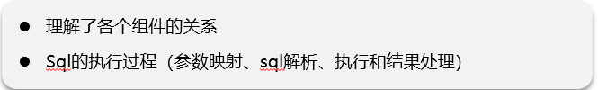
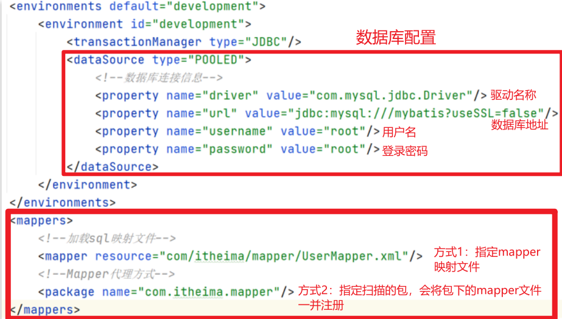
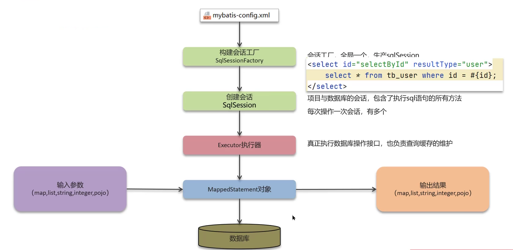
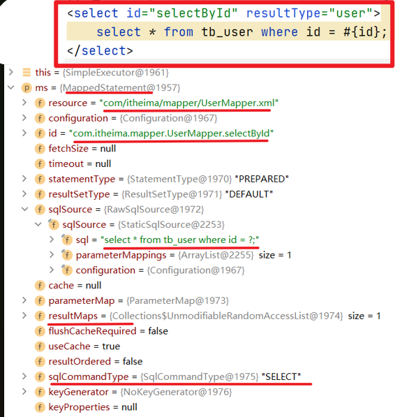

# Mybatis执行流程

## 笔记和理解

>四个小点：参数映射，sql解析，执行过程和结果处理

### 执行流程

>在没有Spring框架的情况下，想要使用mybatis，首先需要一个**mybatis-config.xml**文件，它的作用是用来配置mybatis的一些功能的，包括数据库驱动，链接地址，登录用户，登录密码等，还有sql映射的mapper文件

**执行流程如下**

>①读取mybatis-config.xml文件：由mybatis-config.xml文件加载运行环境和映射文件
>
>②构造会话工厂SqlSessionFactory
>
>③会话工厂创建SqlSession会话对象（里面包含了对sql执行的方法）
>
>④操作数据库接口，Excutor执行器，同时负责查询缓存的维护
>
>⑤Executor接口的执行方法中有一个MappedStatement类型的参数，封装了映射信息
>
>⑥输入参数映射
>
>⑦输出结果映射

**代码体现**

>如下是一段代码执行过程中可看到ms即mappedStatement对象，包含了resource映射文件路径，id映射文件对应执行方法，sql被执行sql语句，resultMaps即结果数目
>
>

