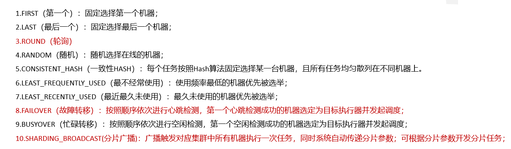
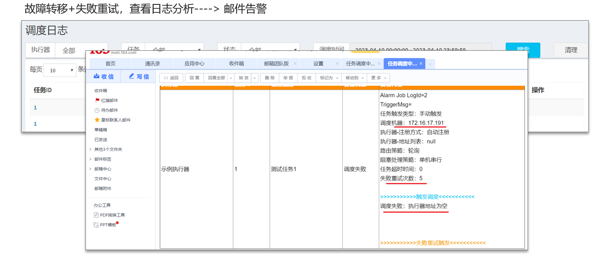
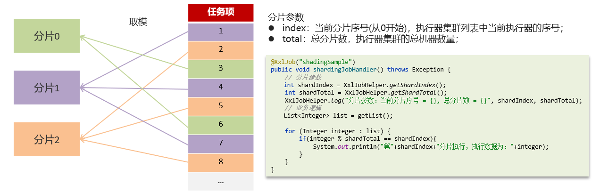

# 使用了什么分布式任务调度

## 笔记和理解

**以XXL-JOB**进行讲解

>首先我们要知道XXL-JOB能够解决的问题
>
>* 集群任务重复执行
>* cron表达式定义灵活
>* 定时任务失败，重试和统计
>* 任务量大，分片执行

### XXL-JOB路由策略有哪些？

>路由策略：如下我们有很多任务，但只需找一台设备执行即可，找哪台设备即是路由策略解决的

>常见策略有如下，不需全记，但只要记住三就行
>
>* ROUND（轮询）经常用
>* FAILOVE（故障转移）：按照顺序进行心跳检测，第一次心跳检测成功的就选定执行任务
>* SHARDING_BROADCAST（分片广播）：广播触发对应集群中所有机器执行一次任务，同时系统自动传递分片参数；可根据分片参数开发分片任务

### 怎么解决任务执行失败问题

>常使用故障转移+失败重试解决
>
>失败重试就是当前机器执行失败，可以根据已剩失败重试次数进行重试
>
>同时也可以进行日志分析后 进行邮件告警

### 若出现大数据量任务同时执行（一台就会耗时很长）该怎么解决

>使用分片广播
>
>在执行器集群部署情况，任务路由策略选择了分片广播的情况，一次任务将会进行分片执行，即将任务分成小部分按照一定算法分到集群里的所有执行器进行执行任务，一般使用取模运算

