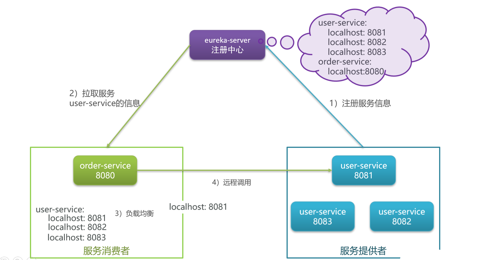
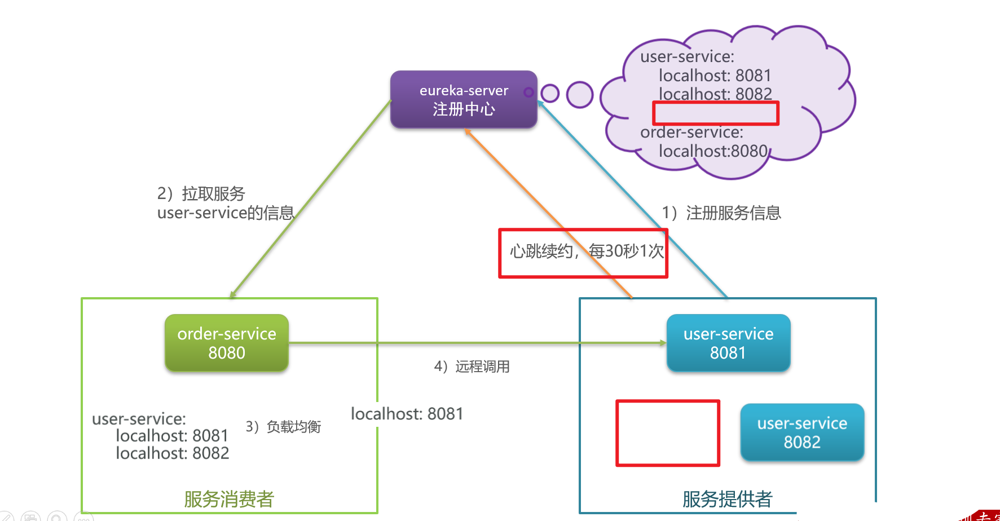
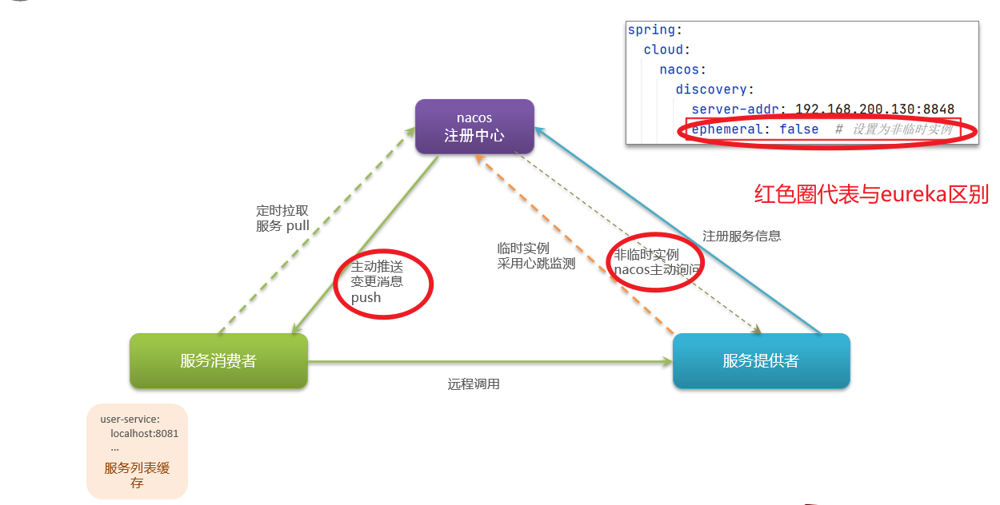
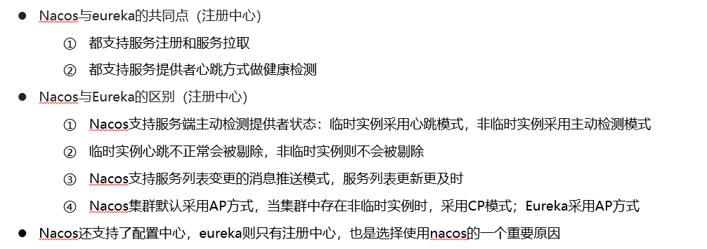

# SpringCloud注册中心

## 笔记和理解

>微服务中必须要使用的组件，考察我们使用微服务的程度
>
>注册中心的核心作用是：服务注册和发现
>
>常见注册中心：eureka,nocas,zookeeper等

### 以Eureka为例，其它可参考

>eureka-server注册中心一旦启动，就需要以下操作
>
>**服务注册**
>
>①服务提供者user-service微服务向注册中心提供自己所有设备的端口，服务名称、ip等等即注册服务信息
>服务消费者order-service微服务也需要向注册中心提供自己的端口信息等以注册服务信息
>
>②order-service从注册中心拉取服务即user-service的信息，包含了所有设备的端口地址
>
>**服务发现**
>
>③order-service通过负载均衡操作选定一台服务提供者设备
>
>④order-service通过远程调用调用服务提供者user-service提供的服务

#### 额外（服务监控）

>如果服务提供者宕机或出现状况这么解决？
>
>即注册中心需要服务提供者使用心跳续约操作，即每30s确认是否有设备死亡，如果死亡则更新注册信息；而服务消费者会因为定时拉取信息，即在下次拉取时跟新

### Nacos工作流程

>Nacos和Eureka区别
>
>在Application.yml配置文件中配置**ephemeral: true**代表此服务是临时实列；可类比=》临时员工，和eureka没什么区别
>
>若是**ephemeral: false**代表是非临时实例；可类比=》正式员工，那么nacos就会主动去关心员工出现问题没，出现了问题后，还会像客户消费者告知，有员工有事情。而不会像临时员工一样直接删除辞退了

### 总结

