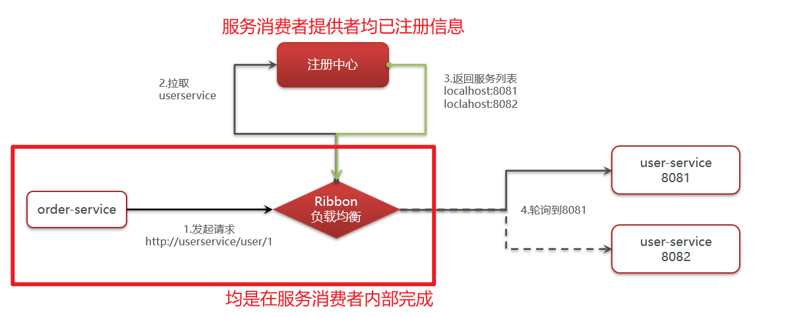
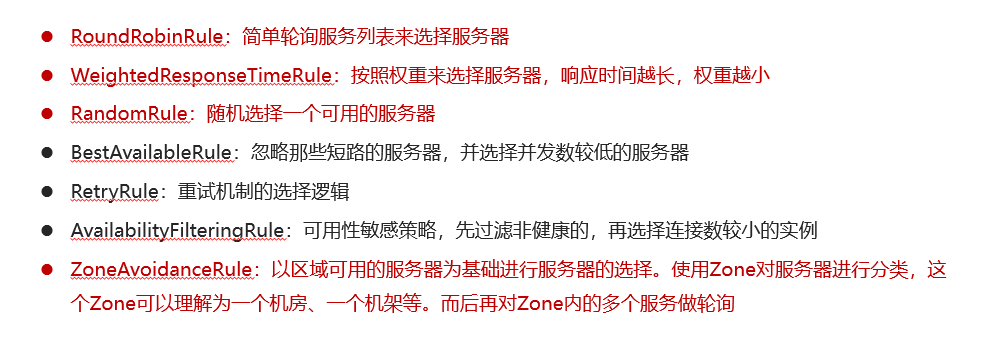
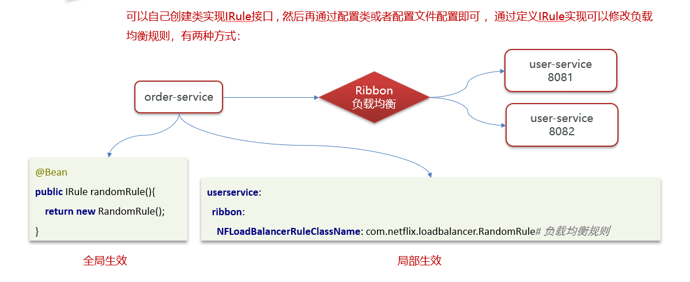

# SpringCloud负载均衡的实现

## 笔记和理解

>我们会使用Ribbon来实现负载均衡

### Ribbon负载均衡流程

>在服务消费者和服务提供者均已将自己的信息注册到注册中心的情况下
>
>①由服务消费者发送服务消费请求，会进入到如Ribbon这种负载均衡的应用中
>
>②由Ribbon这种负载均衡应用向注册中心拉取服务提供者的信息列表
>
>③注册中心返回服务提供者信息列表
>
>④Ribbon使用负载均衡策略选择对应服务提供设备，将请求发送给对应设备

### Ribbon负载均衡策略有哪些

>能说上个两三种即可
>
>①简单轮询RoundRobinRule：简单轮询服务列表来选择服务器
>
>②WeightedResponseTimeRule：按照权重来选择对应服务器，选择权重大的，其中响应时间越长，权重越小
>
>③RandomRule：完全随机的选择可用服务器
>
>④ZoneAvoidanceRule：按照Zone区域划分服务器类别，然后选定一个Zone，再在对应Zone中多个服务轮询调用服务器

### 自定义实现负载均衡策略

>想要实现负载均衡，重要的是实现IRule接口

