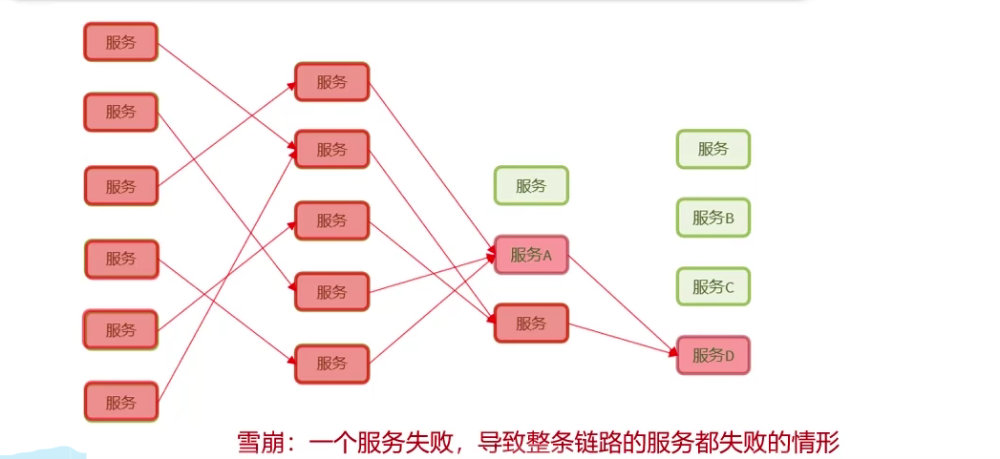
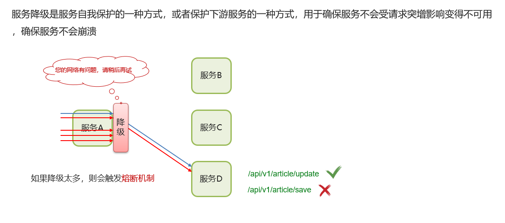
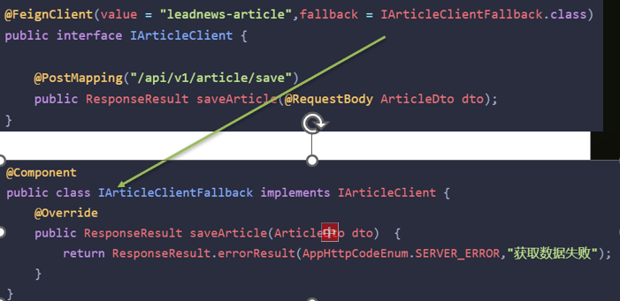
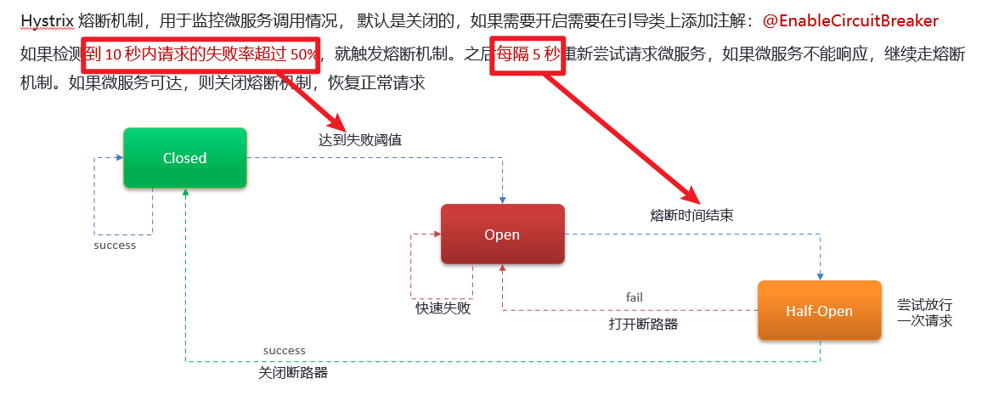

# SpringCloud服务雪崩

## 笔记和理解

### 什么是服务雪崩？

>以下图一个项目所有服务为例子，服务D优先出现服务宕机，然后A原本向服务D请求服务，由于D宕机就不会响应服务A的请求，所以A的链接也不会释放，A没得到对应响应会重新创建链接发送请求，但一直没有结果。最终导致服务A的链接上限，之后就是服务A的崩溃，然后紧接着就会导致左半段的服务全部崩溃，这就是服务雪崩

### 怎么解决

>可以使用**Hystix服务熔断降级**，或**限流**来预防

#### 服务降级

>在如下示例中，服务D有update和save两个接口，其中update接口正常，save接口失效，那么在有访问save接口的服务中则会出现降级服务反馈，即提示“你的网络有问题，请稍后再试”，其中降级服务代码是在下级服务中提供即在服务D中提供

**代码展示**

>如下图中，IArticleClient服务提供了Save接口，当save接口失效就会转向fallback的IArticleClientFallback.class中去，然后执行其中的saveArticle方法

##### 服务熔断

>服务熔断，字面意思，即断开对此服务的所有请求，一致返回NO
>
>Hystrix的熔断机制默认关闭，需要开启请添加@EnableCircuitBreaker注解
>
>开启后
>
>①如果在一定时间内对该服务的请求失败率达到阀值，则会将熔断从关闭状态变为开启状态，此时所有对此服务的请求都会返回NO
>
>②一定时间后，Hystrix会尝试向该服务发送请求是否可服务，此时处于半熔断，
>
>③若失败，则重新进入熔断开启状态，再次等待一定时间；
>
>④若成功，则关闭熔断，服务正常使用

