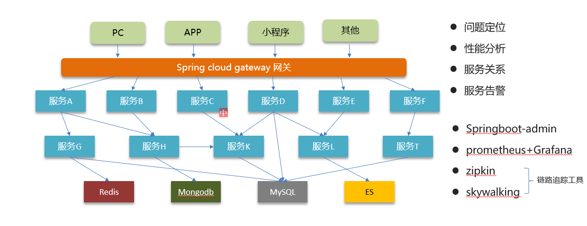
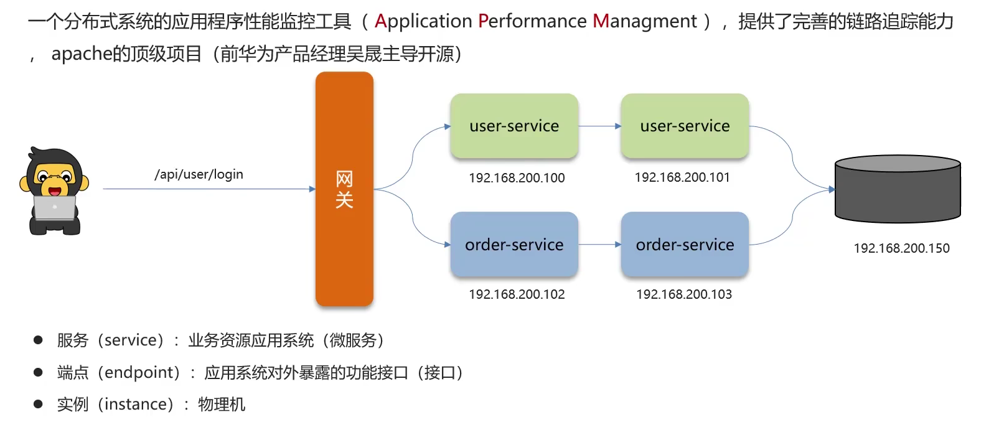
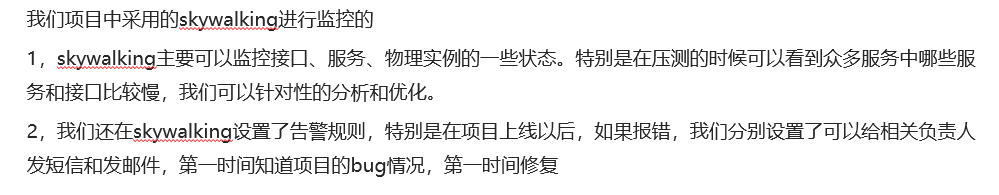

# SpringCloud微服务的监控

## 笔记和理解

### 为什么需要监控？

>我们常常会喜欢有日志这类可看出项目运行状况的东西，因此SpringCloud微服务不可能离开运行状态的监控，有了监控，我们就可以在**问题定位，性能分析，服务关系，服务警告**等信息来管理微服务的状态
>
>
>
>而常用的微服务监控工具有SpringBoot-admin,Prometheus+Grafana,Zipkin,SkyWalking等

### 监控手段

#### Skywalking

>Skywalking介绍：分布式系统的应用程序性能监控工具，提供了完善的链路追踪能力，
>
>了解几个名词：
>
>* 服务（service）：业务资源应用系统（微服务）
>* 端点（endpoint）：应用系统对外暴露的功能接口（接口）
>* 实例（instance）：物理机

### 总结

