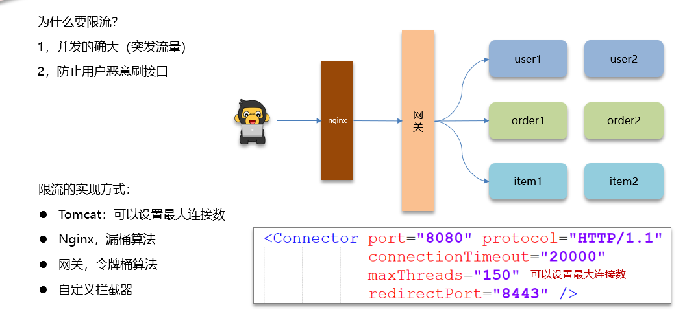
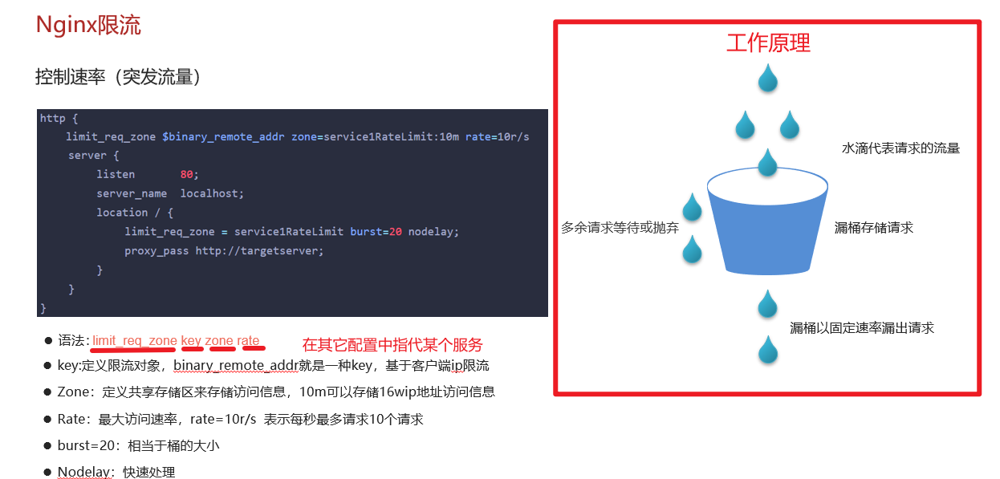
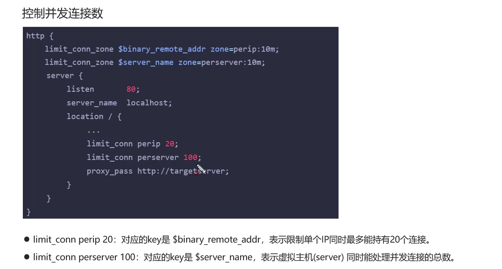
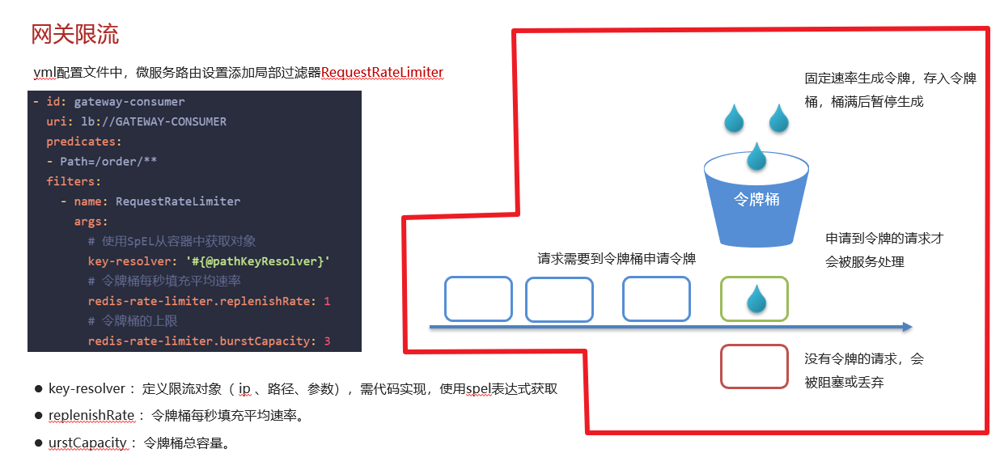
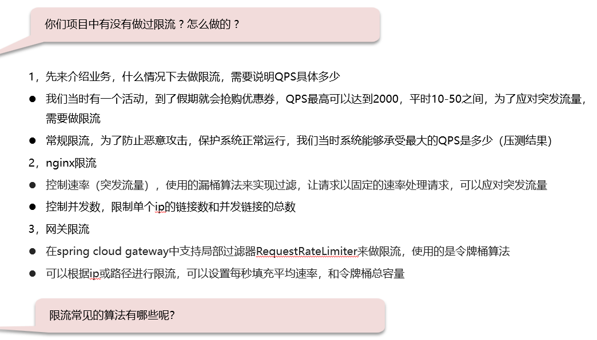

# SpringCloud微服务限流

## 笔记和理解

### 为什么要使用微服务限流

>因为确实会出现以下情况：
>
>①并发流量突然增大，即一段时间内的请求量很多
>
>②有用户恶意刷接口，即也是大量请求某个接口
>
>
>
>一般解决有
>
>* Tomcat：自带部分限流设置，可设置最大连接访问数
>
>* Nginx：使用漏桶算法
>
>* 网关：使用令牌桶算法
>
>* 自定义拦截器

### 限流方式部分讲解

#### Nginx使用的漏桶算法

>主要讲解漏桶算法的原理，即在一个固定大小的桶下开个孔，让桶中的水以一个固定的速度流出，达到即使有大量的水装入，也会慢慢流出，多余的丢掉或等待即可

**Nginx还提供控制并发连接数来达到限流目的**

#### 网关限流使用的令牌桶算法

>在yml配置文件中可对网关进行配置，其中就有对限流的配置，底层使用的就是令牌桶算法，和漏桶算法不同；令牌桶是以固定速率在桶内生成令牌，有请求来了会尝试从桶中获取令牌，如果成功则请求通过，失败则等待令牌生成。

 

### 总结

