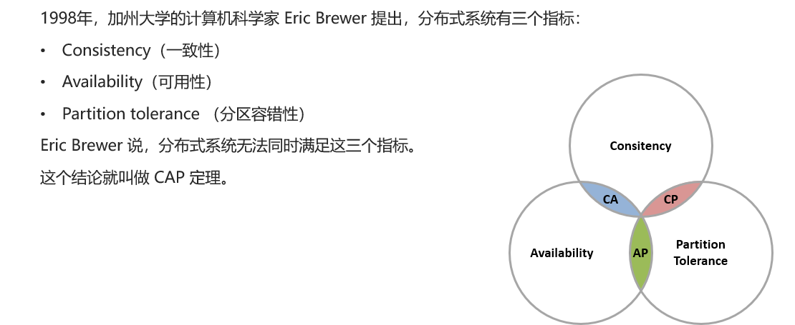
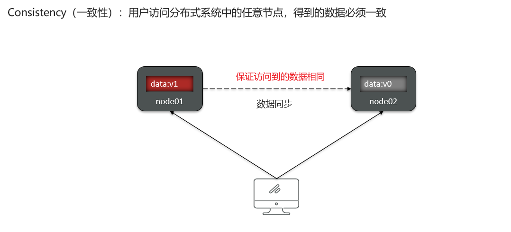
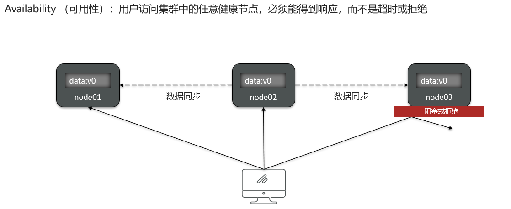
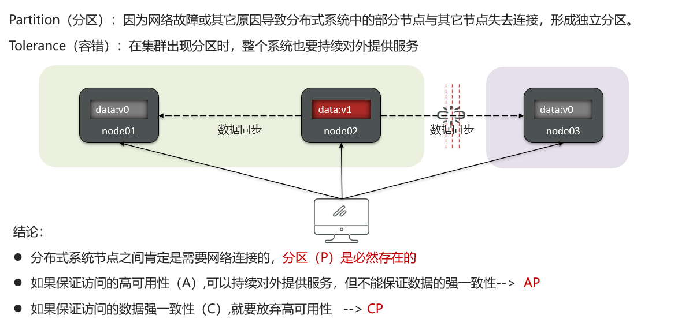
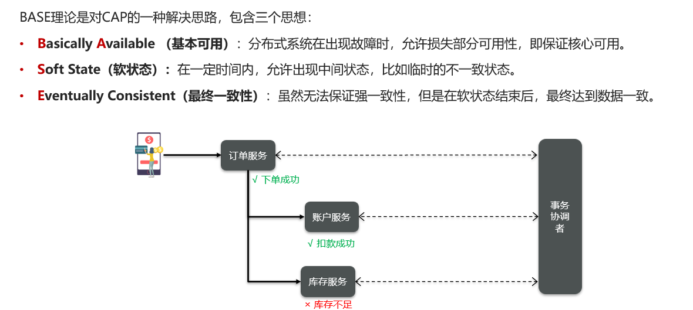

# 分布式系统理论-CAP和BASE

## 笔记和理解

### CAP定理

>由加州大学科学家Eric Brewer提出的分布式系统的三个指标，即**一致性，可用性，分区容错性**，它们三者不能同时满足，最多满足其中之二，这就是**CAP定理**，但它们一定满足P分区性

#### Consistency一致性

>Consistency一致性：保证数据访问分布式系统的任一节点的数据要求相同
>
>
>
>因此为了保证一致性，不同节点就需要有数据同步这个功能

#### Availability可用性

>Availability可用性：用户访问集群中的任意一节点都会得到响应，而不是拒绝和超时

#### Partition tolerance分区容错性

>分区Partition：由于网络的问题导致出现集群中部分节点与其它节点断开连接，形成了新的独立分区
>
>容错tolerance：即使集群出现了分区，也要保证对外提供的服务
>
>
>
>因此
>
>* 如果在提供服务时想要保证访问不同分区的数据相同，就是保证一致性，就是等待网络完成连接，就会出现访问超时导致可用性无法满足
>* 如果在提供服务时想要保证可用性，即就算连接未恢复也去访问服务就会导致访问数据不相同，无法满足一致性
>
>结果
>
>* 满足第一条就是AP，满足第二条就是CP，但是就是没有CAP同时满足

### BASE理论

>Base理论是对CAP理论的解决思路，包括：
>
>* Basiclly Available基本可用：分布式系统在出现故障时，允许损失部分可用性，但要保证核心可用
>* Soft State软状态：出现故障时，允许出现中间态，即不一致到一致的中间，临时不一致
>* Eventually Consistent最终一致性：即使当前是不一致的，但软状态结束后的最终的数据要保证一致性
>
>
>
>在下面的例子中体现BASE解决CAP问题
>
>* 保证最终一致性，即满足临时数据不一致问题，先让系统将服务解决，最终发现数据不一致，又因为事务已提交无法回滚，则根据事务操作的逆向操作一遍达到数据回滚，这是AP
>
>* 强一致性，在提交事务前必须让事务协调器检查数据一致性问题，若出现问题，则直接回滚不进行提交满足数据一致性，但可能导致服务超时，即满足CP

