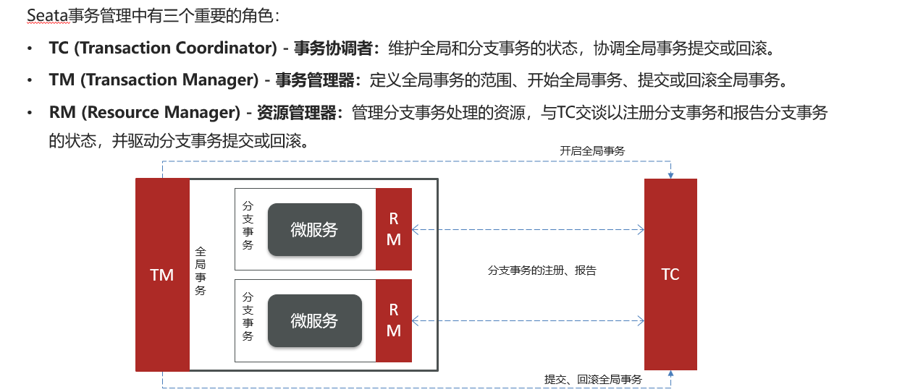
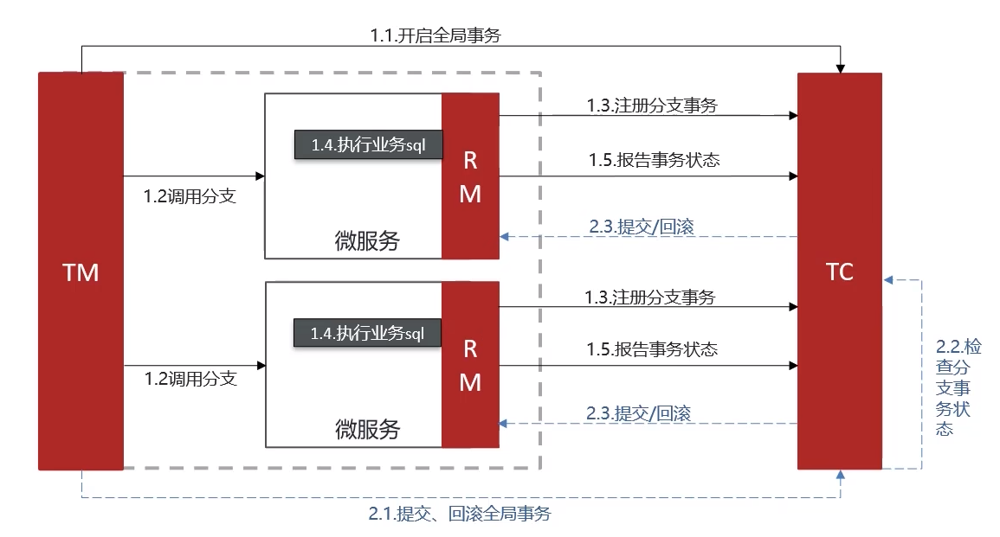
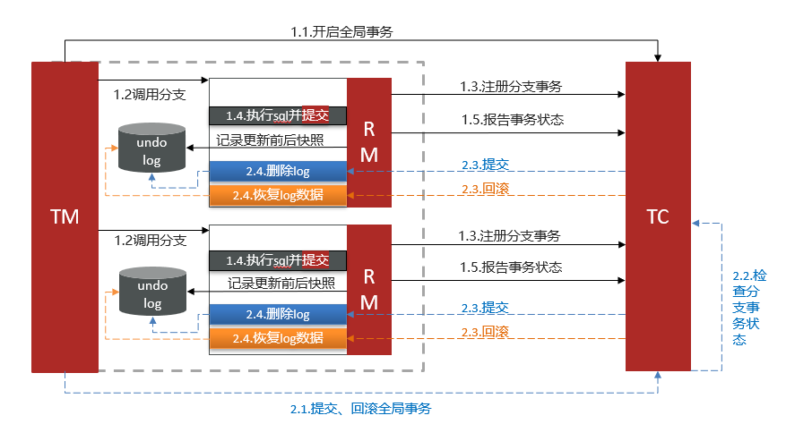
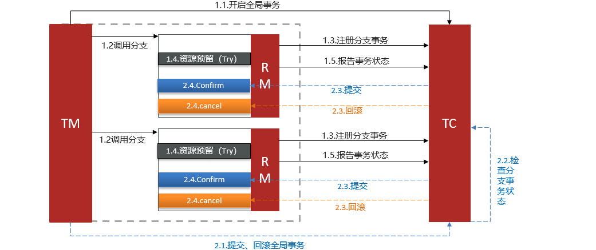
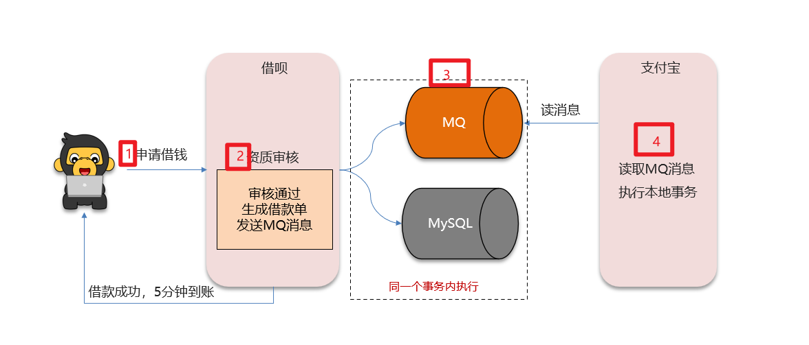

# 分布式事务的解决方案

## 笔记和理解

>若简历上写了微服务模型，则就会有远程调用，此时就会问道用了什么解决方案的问题
>
>常见的有
>
>* 阿里的Seata框架：即（XA，AT，TCC）XA AT TCC连起来了
>* MQ

### Seata框架

>Seata中有三个重要角色
>
>* TC(Transaction Coordinator)事务协调者：维护全局和分支事务的状态，协调**事务的回滚与提交**
>* TM(Transaction Manager)事务管理者：定义全局事务的范围，开始全局事务，**提交和回滚全局事务**
>* RM(Resource Manager)资源管理者：管理分支事务处理的资源，与TC交谈以注册分支事务和报告分支事务的状态，并驱动**分支事务的回滚和提交**
>
>可以把它们看作下面的例子
>
>TC项目管理、TM开发小组leader、RM开发员工、员工负责各个微服务，leader只管把人拉群，项目管理负责协调各模块对接和进度

#### Seata的XA模式（保证了CA模式）

>在XA模式中，工作顺序是这样的：
>
>**一阶段：**
>
>①由TM开启全局事务
>
>②TM调用各个分支，即微服务。让它们可以行动了
>
>③RM先注册自己的事务到TC上
>
>④RM执行自己微服务的业务sql
>
>⑤RM只进行执行不进行提交，报告自己微服务中业务sql执行状态给TC
>
>**二阶段：**
>
>①TM开启TC事务提交/回滚功能
>
>②TC检查各分支的事务完成状态
>
>③帮助各个微服务成功的分支事务进行提交，失败的分支事务进行回滚操作
>
>此模式各个事务需要等待，等待过程中资源锁死

#### Seata的AT模式（保证了AP）

>AT模式的工作顺序如下，我会标明和XA模式不同点
>
>**一阶段：**
>
>①由TM开启全局事务
>
>②TM调用各个分支，即微服务。让它们可以行动了
>
>③RM先注册自己的事务到TC上
>
>**④**RM执行自己微服务的业务sql**并提交，同时写下更新前后快照undo-log**
>
>**⑤**RM报告自己微服务中业务sql执行状态给TC
>
>**二阶段：**
>
>①TM开启TC事务提交/回滚功能
>
>②TC检查各分支的事务完成状态
>
>③帮助各个微服务成功的分支事务进行提交**并删除undo-log**，失败的分支事务**根据undo-log**进行回滚操作
>
>此模式各个事务需要等待，等待过程中资源锁死

#### Seata的TCC模式（保证了AP）

>1、Try：资源的检测和预留； 
>
>2、Confirm：完成资源操作业务；要求 Try 成功 Confirm 一定要能成功。
>
>3、Cancel：预留资源释放，可以理解为try的反向操作。
>TCC模式的执行顺序是：
>
>
>
>但它需要人工编码实现，耦合高

### MQ

