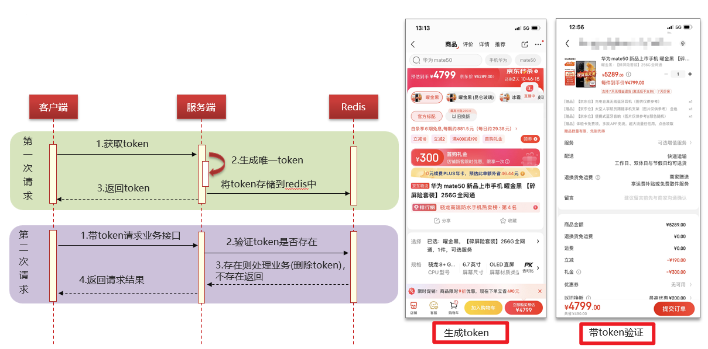
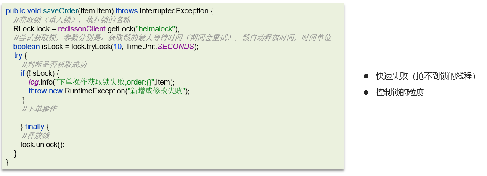

# 分布式事务接口的幂等性问题

## 笔记和理解

>幂等：多次调用方法或接口不会改变业务状态，保证重复调用和一次调用的结果一样
>
>
>
>出现情况：
>
>* 用户重复点击（网络波动卡）
>* MQ消息重复
>* 应用使用失败或超时重试机制

### 接口幂

>根据Restful API常用接口分析幂等性特点
>
>
>
>* GET请求：查询操作，天然幂等
>* **POST请求**：新增操作，因为一次和多次请求会造成数据结果不一致，不是幂等的
>* **PUT请求**：更新操作，分情况
>  * 如果是增量请求，则不是幂等的
>  * 如果是绝对值更新，则是幂等的，情况如下
>* DELETE请求：删除操作，根据唯一值删除，是幂等的
>
>
>
>**解决方法由三**：
>
>数据库唯一索引，可解决新增问题，但不推荐
>
>token+redis，可解决新增、修改
>
>分布式锁，可解决新增、修改

#### token+redis

>token+redis解决步骤：
>
>**第一次请求：**
>
>①客户端向服务端申请获取token
>
>②服务端生成唯一token的同时，将token与客户端的用户名一起存入Redis中
>
>③服务端返回给客户端token
>
>**第二次请求：**
>
>①客户端向服务端发送业务接口请求，同时将用户名和token一起发送
>
>②服务端将用户名和token数据发给Redis进行验证
>
>③Redis发现有，则请求成功并删除token；发现没有则发给服务端失败
>
>④服务端向客户端返回请求结果

#### 分布式锁

### 总结

数据库唯一索引，不推荐

分布式锁性能不好

token+redis性能较好