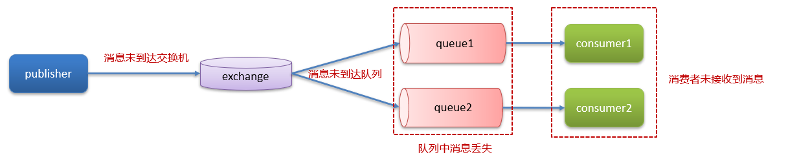
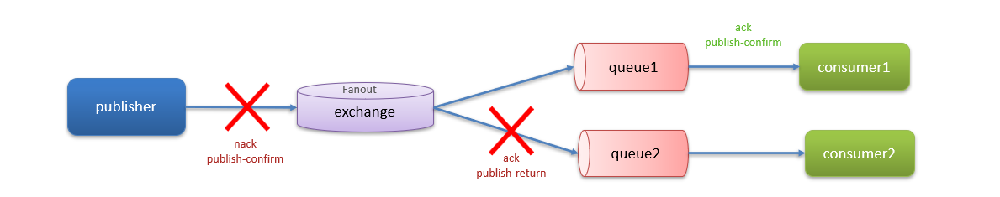
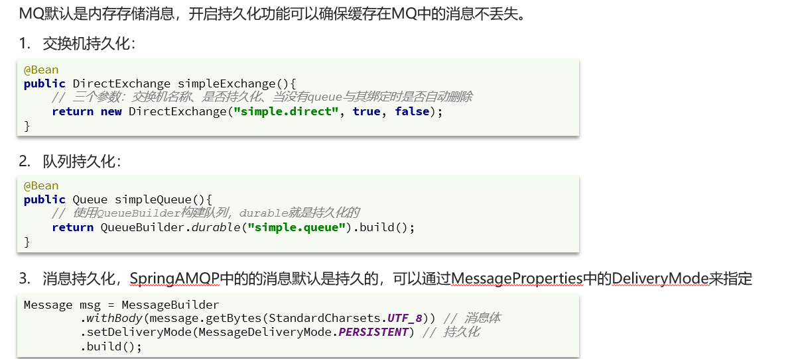
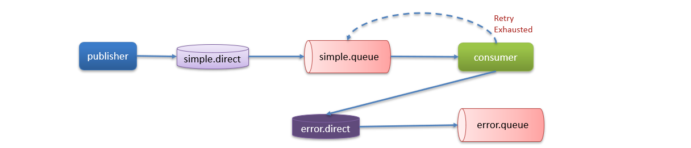

# RabbitMQ保证消息不丢失

## 笔记和理解

>**MQ的应用**
>
>l异步发送（验证码、短信、邮件…）
>
>lMYSQL和Redis , ES之间的数据同步
>
>l分布式事务
>
>l削峰填谷

>**在下列各设备中传送消息都有可能导致消息丢失**
>
>publisher到交换机
>
>交换机到消息队列
>
>消息队列到consumer，consumer丢失

### 生产者确认机制

>生产者确认机制用来解决出现在publisher->exchange之间和exchange到queue之间的问题
>
>即publisher将消息成功到达mq后，会收到mq的一个结果，表示消息是否接收成功

>如果消息发送失败？
>
>* 回调方法即时重发
>* 记录日志
>* 保存数据库然后定时重发，成功发送则删除表中数据

### 消息持久化

>MQ默认是使用内存存储信息，重新开机一定会使数据丢失，我们需要将持久化功能打开，即将数据备份到磁盘中去

### 消费者确认

>即消费者在处理完消息后，返回一个ack确认信息，MQ收到确认ack后才会删除信息
>
>在Spring中，MQ可以配置三种消费者确认模式
>
>* manuel：手动，需要在业务执行完后手动调用api
>* auto：自动，由spring监听listener是否出现异常，没有异常则自动发送确认ack，有则发送nack
>* none：没有，即MQ假定消费者获取消息后会成功处理，因此消息投递后立即被删除
>
>
>
>有时会出现发送的ack/nack消息到达不了，可以这么解决
>
>①可设置重发次数，即retry机制
>
>②若重发次数达到上限还是没有成功，则进入error.direct到error.exchange即异常交换机
>
>③由人工手动处理error.exchange里的消息

