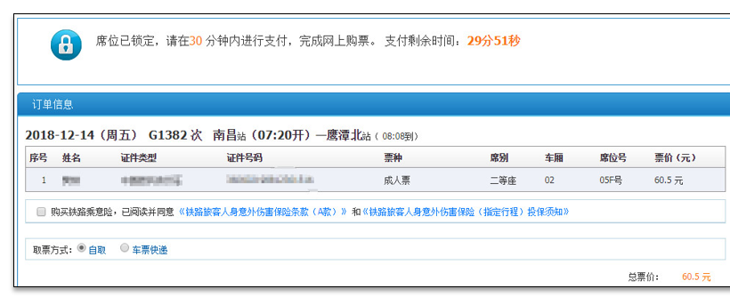
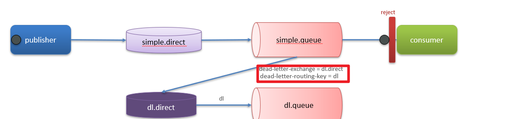
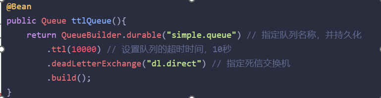
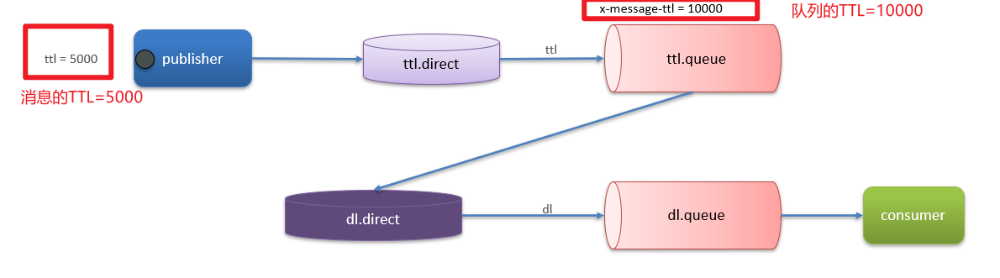
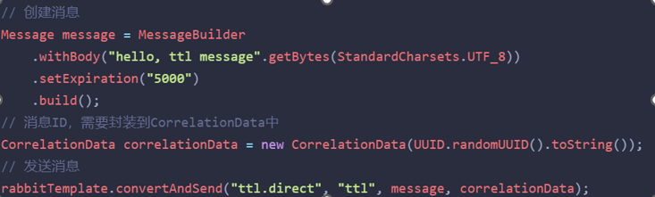
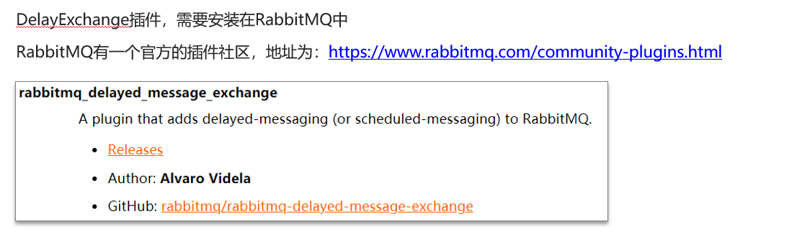
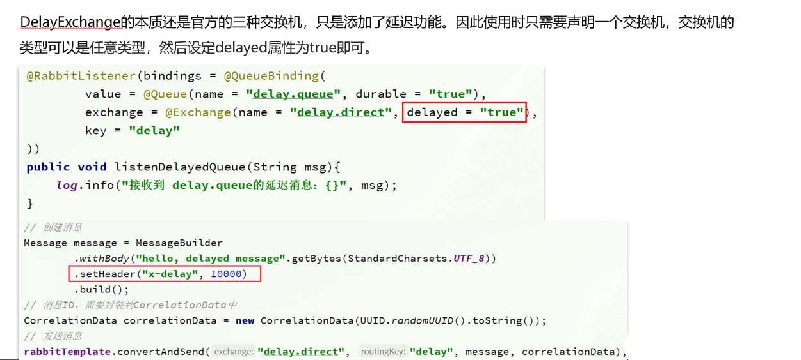

# RabbitMQ中死信交换机

## 笔记和理解

>在了解死信交换机前，可以先知道延迟队列这个东西
>
>
>
>**延迟队列**：消息进入队列中，会被延迟消费
>
>**使用场景：**超时订单，定时优惠，定时发布等需要定时的任务
>
>
>
>而**延迟队列=死信交换机+TTL（生存时间）**

### 死信交换机

>当一个队列中的消息满足下列条件，就有可能成为**死信**
>
>* 消费者明确对当前消息使用了basic.reject或basic.nack声明当前消息消费失败，并且当前消息的requeue重入队列参数为false
>* 有明确TTL的消息
>* 队列的消息要满了，最早一批消息会成为死信
>
>
>
>如果该队列配置了dead-letter-exchange属性，那么成为死信的消息就会根据dead-letter-exchage配置的属性进入到dead-letter-exchange死信交换机（**DLX**）中，然后再进入dead-letter-queue死信队列，接着可配置处理死信的消费者即可

>代码如下

### TTL

>TTL 即 Time-to-Live存活时间，一个队列的消息TTL若结束还没得到消费，那么这个消息就会成为死信
>
>TTL超时分为两种：
>
>* 即队列设置了TTL
>* 消息被设置了TTL
>
>两者都设置了以最小为准

>代码实现

### 额外方式-插件

