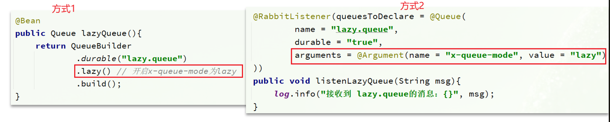

# RabbitMQ消息堆积

## 笔记和理解

### 为什么出现？

>但生产者生产消息的速度超过了消费者消费的速度，那么就会有消息在队列中堆积，达到上限后消息就会成为死信
>
>
>
>解决此问题有三种思路：
>
>* 增加消费者，提高消费速度
>* 在消费者内开启线程池加快消息的处理速度
>* 扩大队列容积，提高队列堆积上限

### 惰性队列

>RabbitMQ的普通队列是在内存中的，不能存储太多消息，那么就可以配置一个惰性队列
>
>* 接收到消息后直接存入磁盘，而非内存
>* 消费者要消费消息时，就会从磁盘读取进行消费
>* 支持百万存储

