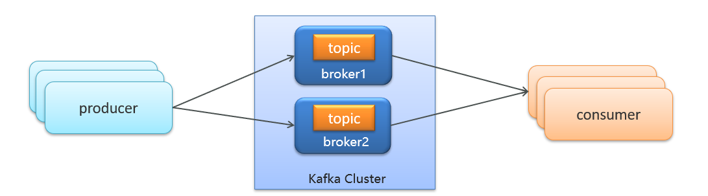
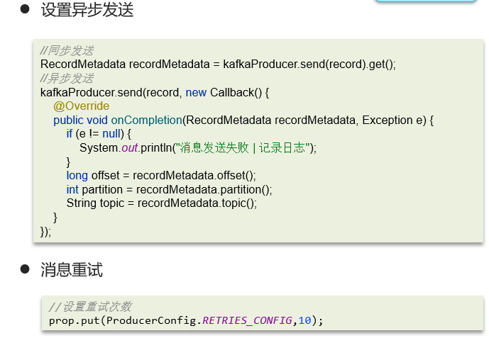
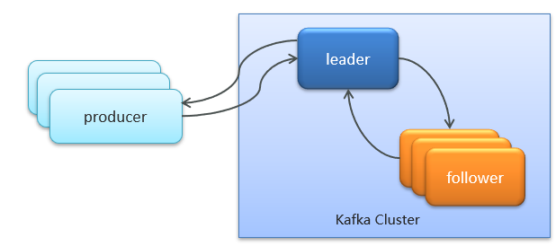
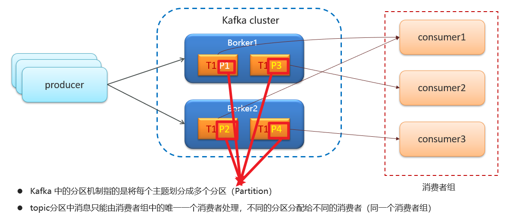
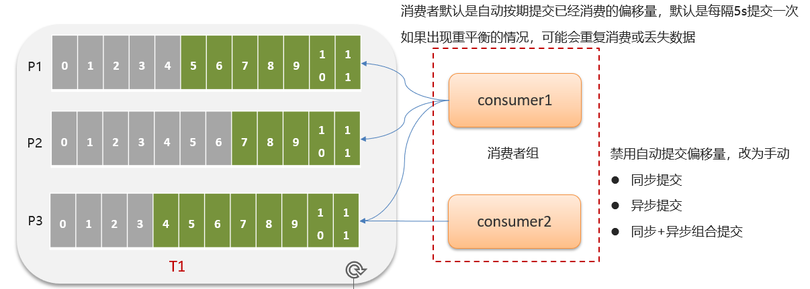
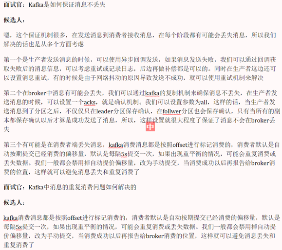

# Kafka如何保证消息不丢失

## 笔记和理解

>KafKa在传递消息时，总会出现消息丢失的情况，有以下三种：
>
>* 生产者传递消息到Broker中间人丢失
>* Broker存储消息丢失
>* 消费者从Broker接收消息丢失
>
>一般解决：

### 生产者发送消息到Brocker丢失

>一般可以用异步发送来判断发送消息是否成功。在异步发送操作中，若异步发送成功，则Exception e为null；否则Exception e就有值，此时在回调函数中就可以通过e来进行一些操作，比如通知或记录日志等
>
>
>
>若发送失败，一般都可以设置失败重发次数，会根据次数达到限制没来进行消息重发

### 消息在Broker存储丢失

>保证消息在Broker存储不丢失使用了ack确认机制，首先在Kafka Cluster即Kafka集群中，会有多个分区，其中**只有一个Leader节点和可能多个follwer节点**，即一主多从，然后ack有三种参数
>
>* ack=0：即生产者在生产完消息后不会等待任何服务器的响应，消息有丢失的风险，但是速度最快
>* ack=1：即生产者在生产完消息后，只要Leader存储完毕就会响应ack信息，**最低保障**
>* ack=all：生产者生产完消息后，除了等待Leader存储完所有消息，还需等待Leader的参与赋值的从节点follwer存储完消息后才会发送响应ack信息，**此模式最慢**

### 消息在消费者从Broker中接收时丢失

>出现情况是消费者组不同消费者消费属于自己的信息时，会自动提交当前消费的offset偏移量，当某次突然宕机了还没有提交offset后，会导致新接手的消费者不知道当前消费信息是否已经消费或没有消费

### 总结

