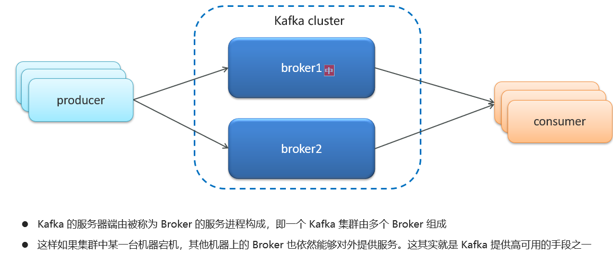
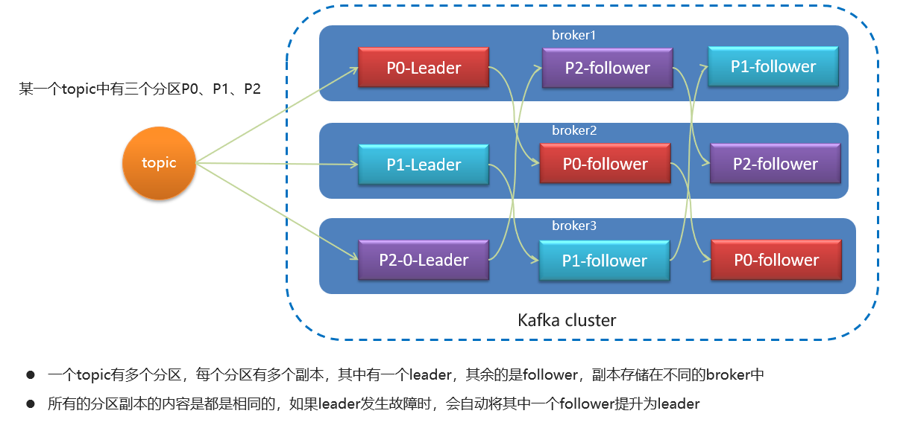
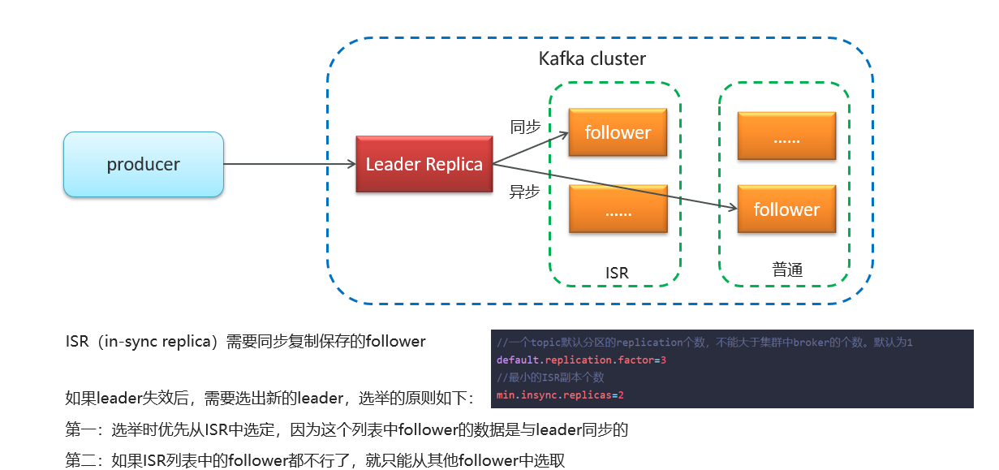

# KafKa的高可用机制

## 笔记和理解

>常用方法有两类
>
>* 集群模式
>* 分区备份机制

### 集群模式

>在Kafka cluster中有多个Broker中间件集群，当其中一个宕机，则会有另外一台设备顶上来

### 分区备份机制

>机制解释：
>
>一个Topic可能会有多个分区，而每个分区分为一个主多个从，所有的从分区都是主分区的复制，并且这些从分区会放在不同的中间件Broker中，一旦其中某个Topic的主分区宕机，则立马会有其它Broker中的从分区顶替作为新的主分区，这样即增加了容错性，同时实现了高可用

>follower从设备晋升规则是这样的，
>
>在使用分区备份机制的主从分区中，从分区又被分为了ISR(in-sync replica)和普通分区，前者使用同步复制主分区数据，数据更接近主分区，但复制一次性能消耗大；后者使用异步复制主分区数据，性能消耗小，但数据和主分区一致性差。因此优先选择ISR里的follower分区晋升，实在没有了再选普通分区

