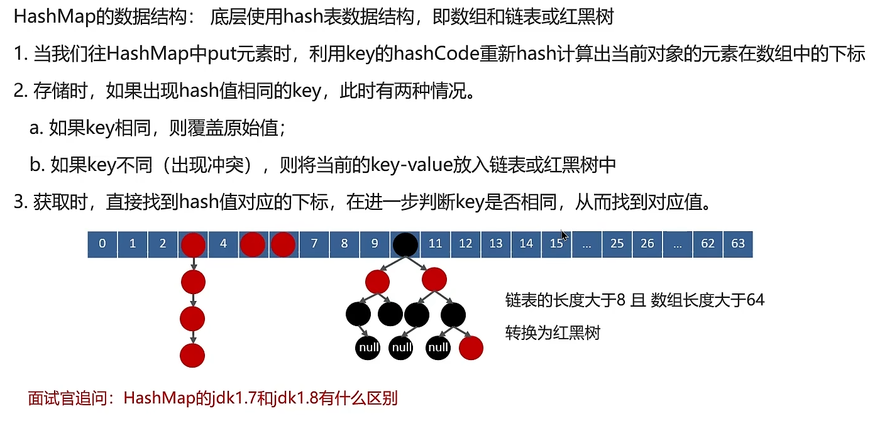
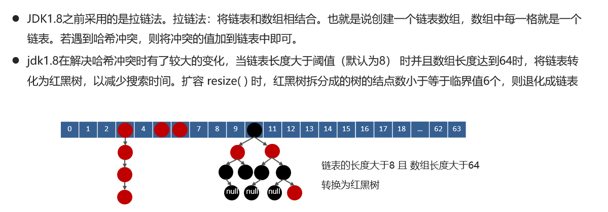

# HashMap的实现原理

## 笔记和理解

>底层使用的是Hash表数据结构，数组和链表或红黑树
>
>进行put值时，计算key的hash值，若hash相同，则判断key，相同key则覆盖原值，不同key则放入当前hash的链表或红黑树中
>
>进行get值时，计算key的hash然后再根据key获取对应值

### java1.8和1.7的hashMap的区别

>1.8后的会进化成红黑树

