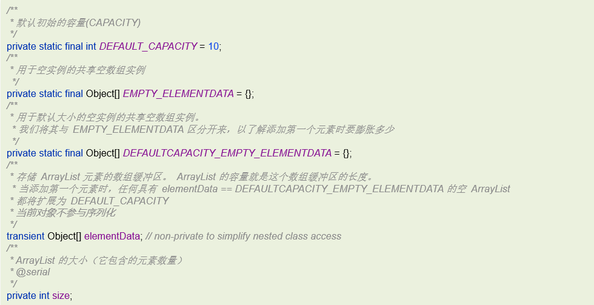
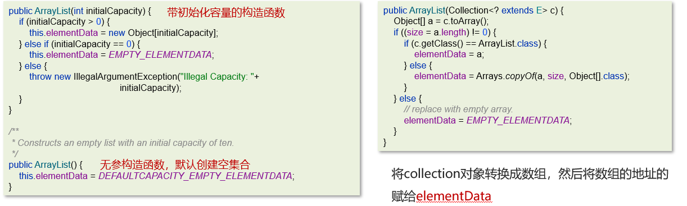
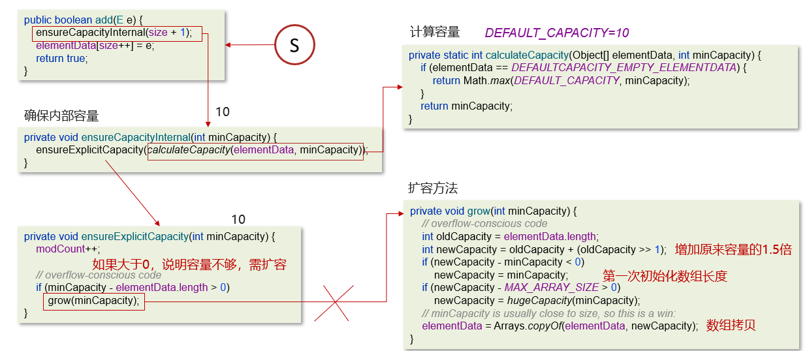
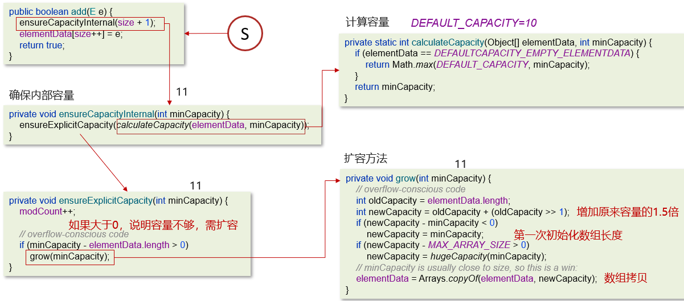

# ArrayList源码分析

## 笔记和理解

>成员属性如下图
>
>其中几个特别说出：
>
>* elementData：真实存放ArryaList元素的地方
>* size：elementData里真实数据的个数，删除或添加都会使其-1或+1
>* DEFAULT_CAPACITY：一旦ArrayList初始添加元素elementData就会初始的空间大小

### ArrayList源码分析-构造方法

>构造方法有3个
>
>有参构造2个，如下，collection是多有单列集合的父类
>
>无参构造一个

### ArrayList源码分析-添加和扩容操作(第1次添加数据)

### 第二次到第十次添加数据

### 第十一次添加数据

