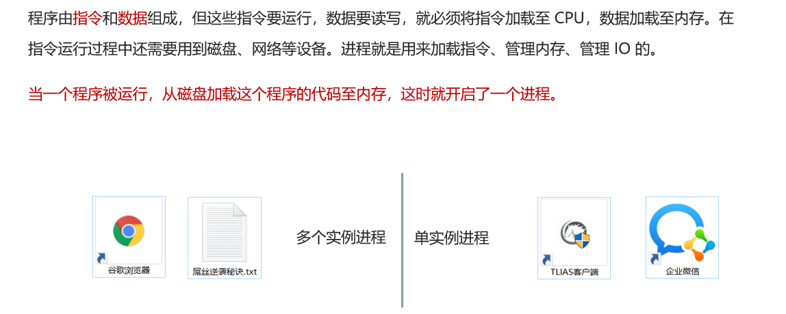
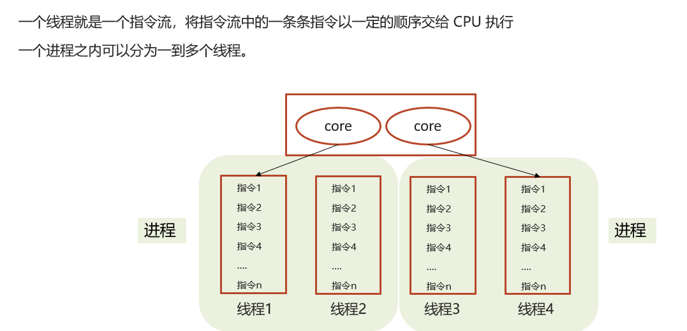
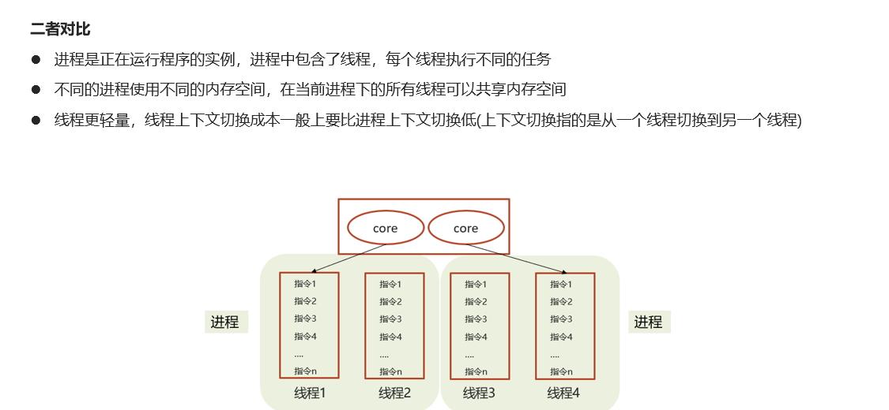

# 线程和进程的区别

## 笔记和理解

### 进程和线程的区别

#### 进程

>进程是用来加载组成程序的指令，管理程序要用的数据所存放的地方内存和硬盘，管理数据的输入输出，即IO的

#### 线程

>线程是由程序的多条指令组成的指令流，一个进程可划分为多个线程

### 进程和线程的区别

>* 进程是正在运行程序的实例，一个进程下有多个线程，每个线程执行不同的任务
>* 不同进程占用不同的内存空间，同一个进程下的所有线程共享一个内存空间
>* 线程更加轻量，切换上下文消费更小，上下文切换指的就是线程/进程切换

